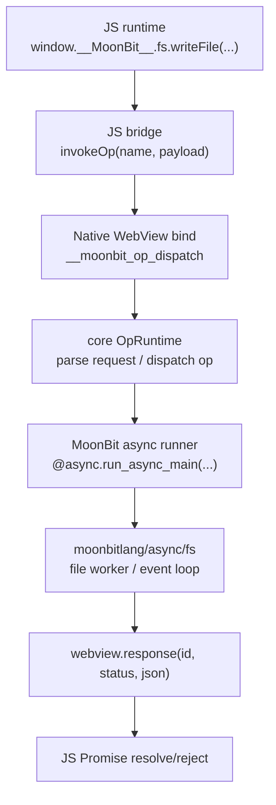
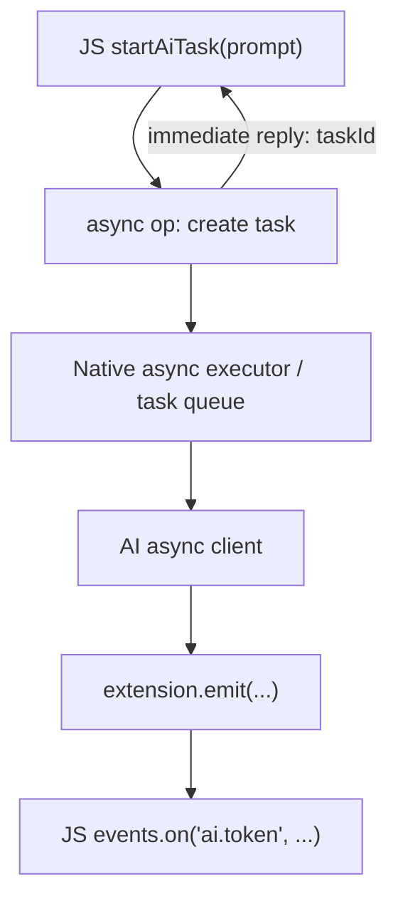

# 异步事件循环与 JS-Native Bridge 设计

本文说明 Lepus / MoonBit WebView runtime 里的异步事件循环模型：JS 如何调用 MoonBit，MoonBit 如何进入 `moonbitlang/async`，异步任务如何把结果或事件发回 JS，以及这套机制和 Tauri、Electron、Wails、zero-native 一类框架的关系。

## 目标

WebView 应用里天然有多个事件循环：

- Browser/WebView 里的 JS event loop。
- Native WebView / GUI backend 的事件循环。
- MoonBit async runtime 的 scheduler / event loop。
- 未来 AI、文件、网络、子进程等能力自己的异步任务队列。

如果直接把这些循环混在一起，最容易出现两类问题：

- JS 调 native 后拿不到 Promise completion。
- MoonBit async 代码没有 scheduler 上下文，调用 `moonbitlang/async/fs` 时在 current coroutine 处 panic。

因此 bridge 需要做一件明确的事：把 WebView 的同步 `bind` callback 转换成一个可完成 JS Promise 的异步 op。

## 当前分层



核心原则：

- `webview.bind(...)` 仍然是同步 native callback。
- async op 不直接作为 `bind` callback。
- `bind` callback 只负责解析 request、找到 op handler、启动 MoonBit async runner。
- async callback 完成后，必须调用 `webview.response(...)`。
- JS 侧仍然只看到一个 Promise。

## 为什么不能直接 `%async.run`

`%async.run` 只能启动一个 coroutine 片段，但它不建立完整的 `moonbitlang/async` event loop 上下文。

`moonbitlang/async/fs` 内部会进入 event loop / worker 机制，并检查 current coroutine。没有 scheduler 上下文时，会在类似 `current_coroutine()` 的路径上失败。

因此正确入口不是裸 primitive，而是 async 包对外集成 runner：

```moonbit
///|
/// Runs one async op callback inside the MoonBit async event loop.
fn run_async_task(callback : async () -> Unit) -> Unit {
  @async.run_async_main(callback)
}
```

这件事的语义是：每次 async op 进入一个 MoonBit async event loop，由它负责 current coroutine、worker job、timer、IO continuation 等调度上下文。

## Async bind 的基本形状

底层可以抽象成一个 typed async bind：

```moonbit
///|
fn bind_async[Payload : @json.FromJson, Reply : ToJson](
  webview : @webview.Webview,
  name : String,
  callback : async (Payload) -> Result[Reply, String],
) -> Unit {
  webview.bind(name, fn(raw_id, raw_req) {
    let id = @ffi.from_cstr(raw_id)
    run_async_task(async fn() {
      let result : Result[Json, String] = try {
        let request_json : Result[Json, _] = try? @json.parse(
          @ffi.from_cstr(raw_req),
        )
        match request_json {
          Err(err) => Err(err.to_string())
          Ok(request_json) => {
            let args : Result[Array[Payload], _] = try? @json.from_json(
              request_json,
            )
            match args {
              Err(err) => Err(err.to_string())
              Ok(args) =>
                if args.length() == 1 {
                  callback(args[0]).map(fn(reply) { ToJson::to_json(reply) })
                } else {
                  Err("Expected exactly one argument")
                }
            }
          }
        }
      } catch {
        err => Err(err.to_string())
      }

      match result {
        Ok(reply) => webview.response(id, 0, reply.stringify())
        Err(message) =>
          webview.response(id, 1, Json::string(message).stringify())
      }
    })
  })
}
```

目前 core 里不是直接暴露 `bind_async`，而是把它提升到了 op/extension 层：

```moonbit
extension.op_async_result("readFile", async fn(payload : ReadFilePayload) {
  // async body
})
```

这比 raw bind 更适合框架，因为 op 层可以统一处理：

- JSON decode / encode。
- op name registry。
- extension namespace。
- duplicate detection。
- Promise resolve / reject。
- 后续 tracing、permission、resource table、cancellation。

## fs 示例

同步版本的大致流程是：

```text
JS fs.writeFile()
  -> WebView bind
  -> op_result callback
  -> moonbitlang/x/fs
  -> webview.response()
```

异步版本变成：

```text
JS fs.writeFile()
  -> WebView bind
  -> op_async_result callback
  -> @async.run_async_main(...)
  -> moonbitlang/async/fs
  -> webview.response()
```

fs 文本 op 使用的是：

```moonbit
extension.op_async_result(api_name, async fn(payload : WriteFilePayload) {
  with_resolved_path_async(payload.path, resolve_write_path, async fn(
    resolved_path,
  ) {
    write_text_file_async(resolved_path, payload.content, payload.encoding)
  })
})
```

底层 async fs helper：

```moonbit
async fn write_text_file_async(
  path : String,
  content : String,
  encoding : String?,
) -> Result[WriteFileReply, String] {
  match resolve_text_encoding(encoding) {
    Err(message) => Err(message)
    Ok(_) =>
      try {
        @async_fs.write_file(path, content, create_mode=CreateOrTruncate)
        Ok(WriteFileReply::{
          path,
          written: true,
          bytes_written: bytes_written_for_text(content),
        })
      } catch {
        err => Err("Failed to write file: " + err.to_string())
      }
  }
}
```

测试应该覆盖两层：

- 包内 async test：验证 `moonbitlang/async/fs` helper 本身可用。
- WebView 集成测试：验证 JS Promise -> native bind -> MoonBit async event loop -> response 的完整链路。

第二类测试很关键，因为它能抓出“helper 在 async test 里能跑，但 WebView bind 中没有 scheduler”的问题。

## 当前机制的性质

当前实现可以称为：

```text
sync WebView bind + per-op MoonBit async event loop + promise response
```

它的优点：

- 实现简单。
- 对现有 WebView bind API 侵入小。
- 正确建立 `moonbitlang/async` scheduler 上下文。
- 很适合 fs read/write、短网络请求、一次性 AI 请求。

它的限制：

- 每个 async op 单独进入一次 async runner。
- 如果 WebView bind callback 在 UI 线程执行，长时间任务仍可能占用 native callback 所在线程。
- 不适合作为长期后台任务、持续流式事件、多任务并发调度的最终形态。

所以它是正确的第一阶段，但不是最终的 async host。

## 长任务和 AI 流式事件

AI 场景通常不是单次 reply，而是：

```text
JS startTask(prompt)
  <- { taskId }

Native emits:
  ai.token
  ai.tool_call
  ai.tool_result
  ai.done
  ai.error
```

推荐模型是：



也就是说，长任务不要让 invoke Promise 一直承担全部生命周期。更好的拆分是：

- `startAiTask`：快速返回 `taskId`。
- native async executor：后台跑实际任务。
- `events.emit`：把 token、状态、工具调用发回 JS。
- `cancelAiTask(taskId)`：显式取消。
- `getTaskState(taskId)`：查询状态或恢复 UI。

这要求 runtime 增加一个更长期的 async host：

```text
AsyncHost
  task table
  cancellation table
  event emit sink
  native/UI thread response dispatcher
```

阶段性路线：

1. 现在：per-op `run_async_main`，先保证 async/fs 正确。
2. 下一步：抽象 `AsyncExecutor::spawn(...)`，op callback 不直接管理 runner。
3. 再下一步：常驻 executor + task table + cancellation。
4. 最终：streaming event protocol，支持 AI token、progress、tool events。

## 与 Tauri 的关系

这套机制和 Tauri 最接近。

相似点：

- 前端运行在 WebView。
- JS 调 native command / op。
- JS 侧拿到 Promise。
- native 侧可以执行异步任务。
- native 可以向前端 emit event。
- 能力最好通过 command/extension 显式暴露，而不是随意开放全局 native API。

差异：

- Tauri 的 native host 是 Rust，通常建立在 Rust async ecosystem 和 Wry/Tao 等事件系统上。
- Lepus 这里的 native async 是 MoonBit 的 `moonbitlang/async`。
- 当前 Lepus 仍处于 per-op runner 阶段，Tauri 更成熟地把 command、event、window lifecycle 统一在 runtime 里。

因此可以说：

```text
API 形状：接近 Tauri command invoke
安全边界：接近 Tauri capability / command whitelist
当前实现阶段：比 Tauri 更底层，需要继续抽象 AsyncHost
```

## 与 Wails 的关系

这套机制也很接近 Wails。

相似点：

- 前端是 WebView。
- 后端暴露方法给 JS。
- JS 调用后端方法时通常以 Promise 形式工作。
- 后端可以发事件到前端。
- 后端语言有自己的并发模型。

差异：

- Wails 后端是 Go，异步和并发主要来自 goroutine、channel、context。
- Lepus 后端是 MoonBit，异步依赖 `moonbitlang/async` scheduler/event loop。
- Wails 的 Go runtime 天然常驻，适合长期后台任务；Lepus 当前还需要补一个常驻 async executor。

所以：

```text
调用模型接近 Wails
并发模型不同：Wails 是 goroutine，Lepus 是 MoonBit async coroutine
未来 AsyncHost 做出来后，会更像 Wails runtime + events
```

## 与 Electron 的关系

Electron 不太接近。

相似点只有：

- 都有 renderer。
- 都有 main/native 侧。
- 都通过 IPC 或 bridge 让前端调用后端。

关键差异：

- Electron 自带 Chromium + Node.js。
- main process 和 renderer process 都是 JS/Node/Chromium 事件循环。
- Electron 的异步主轴是 Node.js event loop、Chromium message loop、IPC。
- Lepus 的目标是 system WebView + small native host，不把 Node runtime 带进来。

所以 Electron 更像：

```text
JS runtime calls another JS/Node/native process through IPC
```

而 Lepus 更像：

```text
WebView JS calls MoonBit native op through a small typed bridge
```

结论：Electron 在“多进程 IPC”概念上有参考价值，但不是最接近的模型。

## 与 zero-native 的关系

如果这里说的 zero-native 是“轻量 WebView + native bridge + JS Promise invoke”这一类框架，那么它和 Lepus 的方向也接近。

相似点通常会是：

- 不内置完整 Node/Electron runtime。
- 通过系统 WebView 承载 UI。
- native 能力通过显式 bridge 暴露给 JS。
- JS 调用 native 后拿 Promise。

差异取决于 zero-native 的具体实现：

- 如果它用 JS/QuickJS/Node 做 native host，则异步模型更靠 JS event loop。
- 如果它用 C/C++/Rust/Go 做 native host，则更像 Tauri/Wails。
- Lepus 的关键特征是 MoonBit async scheduler，需要明确接入 `moonbitlang/async` event loop。

因此可以把 zero-native 放在“轻量 WebView native bridge”这组里，但具体相似度要看它的 host runtime。

## 相似度排序

按机制相似度排序：

| 框架 | 相似度 | 原因 |
| --- | --- | --- |
| Tauri | 最高 | WebView + native command + Promise + event emit + capability mindset |
| Wails | 高 | WebView + native backend methods + events；区别是 Go runtime vs MoonBit async |
| zero-native | 中到高 | 如果是轻量 WebView bridge，则方向接近；具体取决于 host runtime |
| Electron | 中低 | 有 IPC 和 renderer/main 概念，但整体是 Chromium + Node 多进程模型 |

一句话：

```text
Lepus async bridge 最像 Tauri/Wails，不像 Electron。
```

更精确地说：

```text
Lepus = system WebView + typed native op registry + MoonBit async runner + JS Promise/event bridge
```

## 推荐演进方案

### 阶段 1：typed async op

当前已经具备：

- `ExtensionContext::op_async`
- `ExtensionContext::op_async_result`
- `OpRegistry::handle_async_result`
- `run_async_task`
- `fs` 文本 op 使用 `moonbitlang/async/fs`

适合：

- 文件读写。
- 一次性 native command。
- 简单网络请求。
- 非流式 AI 调用。

### 阶段 2：AsyncExecutor

把 runner 从 op registry 里抽出来：

```moonbit
struct AsyncExecutor {
  // future: queue, task table, cancellation, host dispatch
}

fn AsyncExecutor::spawn(
  self : AsyncExecutor,
  task : async () -> Unit,
) -> TaskId
```

op runtime 不再关心具体 runner，只调用 executor。

### 阶段 3：Task + Event Protocol

为长任务建立统一协议：

```text
startTask(payload) -> { taskId }
cancelTask(taskId) -> { cancelled }
task event:
  { taskId, kind, payload }
```

事件类型：

- `started`
- `progress`
- `token`
- `tool_call`
- `tool_result`
- `done`
- `error`
- `cancelled`

### 阶段 4：Host dispatcher

如果 async task 跑在非 UI/native callback 线程，不能随便直接调用 WebView API。需要 host dispatcher：

```text
async worker thread
  -> enqueue UI action
  -> WebView/GUI event loop
  -> emit / response
```

这一步会让模型更接近成熟的 Tauri/Wails runtime。

## 设计原则

- JS-facing API 应始终 Promise 化。
- Native capability 应通过 extension/op 显式注册。
- async task 不应绕过 op registry 随意创建 global binding。
- raw `webview.bind` 应保留为底层 escape hatch。
- 文件、网络、AI 这类能力应使用 async op。
- 长任务应返回 `taskId`，用 event 流传递进度。
- cancellation 必须进入设计，不要只靠页面关闭。
- response 和 emit 最终都要经过 WebView 所在线程认可的调度路径。

## 结论

这套事件循环机制本质上是：

```text
WebView JS event loop
  + native bind callback
  + MoonBit async event loop
  + typed op registry
  + JS Promise/event bridge
```

它和 Tauri/Wails 的思想最接近：前端是 WebView，native 是能力宿主，JS 通过 Promise command 调 native，native 通过 event 回推状态。

它和 Electron 的关系较远：Electron 的中心是 Chromium + Node + 多进程 IPC，而 Lepus 的中心是轻量 WebView + MoonBit native runtime。

当前 per-op async runner 是一个正确的最小实现；要支撑 AI 流式事件、后台任务和更强并发，下一步应该做常驻 `AsyncExecutor` 和 task/event protocol。

## 参考

- Tauri command 与前后端调用模型：https://tauri.app/develop/calling-rust/
- Tauri events：https://tauri.app/develop/calling-frontend/
- Electron process model：https://www.electronjs.org/docs/latest/tutorial/process-model
- Electron IPC：https://www.electronjs.org/docs/latest/tutorial/ipc
- Wails methods：https://wails.io/docs/howdoesitwork/#methods
- Wails events：https://wails.io/docs/reference/runtime/events/
