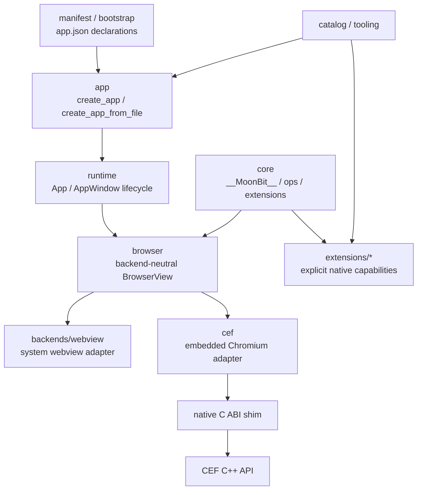

# Lepus 内嵌 Chromium / Electron-like 后端设计

本文档描述如何把 Lepus 从当前的 system webview 架构扩展为可选的内嵌 Chromium 架构，并让上层开发体验接近 Electron，同时保留 Lepus 现有的 MoonBit-native、显式链接、小运行时方向。

本文档是设计规划，不是实现说明。当前推荐路线是新增可选的 CEF 后端，而不是直接改造为 Electron 或默认捆绑所有 Chromium 运行时文件。

## 结论

推荐目标：

```text
Lepus = MoonBit runtime + explicit extensions + pluggable browser backend

默认后端: system webview
可选后端: CEF / embedded Chromium
未来能力: Electron-like BrowserWindow / IPC / preload style API
```

不推荐目标：

```text
Lepus = Electron clone
Lepus = Node.js in renderer by default
Lepus = every app bundles Chromium by default
Lepus = manifest auto-links every native extension
```

核心改造不是“把 Chrome 塞进当前 `Webview` 结构”，而是先抽出浏览器后端边界，让 `core`、`runtime`、`app` 不再直接依赖当前 `justjavac/lepus` 的 webview binding。CEF 是一个独立后端，它需要自己的初始化、消息循环、多进程、IPC、资源布局和打包策略。

## 背景

当前仓库的分层已经比较适合扩展：

```text
src/
  low-level webview binding

core/
  window.__MoonBit__
  op runtime
  JS bridge
  extension host
  resource table

runtime/
  App
  window lifecycle
  extension installation on windows
  AppEntry loading

app/
  manifest + explicit extension registry -> runtime App

manifest/
  declarative app.json-style types

bootstrap/
  app.json parsing and editing

extensions/
  opt-in native capabilities
```

现有调用链大致是：

```text
App::new
  -> create_app_window
  -> @webview.Webview::new
  -> @core.ensure_core_runtime(webview)
  -> install window.__MoonBit__ scripts
  -> bind native op dispatcher

JS
  -> window.__MoonBit__.<extension>.<method>(payload)
  -> window.__MoonBit__.core.invokeOp("ext:<extension>/<method>", payload)
  -> native binding
  -> OpRuntime::handle_request
  -> OpRegistry::call
  -> MoonBit extension handler
  -> webview.response
  -> JS Promise
```

这套 JS/native 边界值得保留。需要替换的是底层 browser transport，而不是 `window.__MoonBit__` 这套上层语义。

## 术语

| 术语 | 含义 |
|---|---|
| system webview | 当前基于 `webview/webview` 的后端。Windows 使用 WebView2，macOS 使用 WebKit，Linux 使用 WebKitGTK。 |
| CEF | Chromium Embedded Framework，用于在原生应用中嵌入 Chromium。 |
| browser process | Chromium/CEF 的主进程，负责窗口、网络、浏览器生命周期和调度。 |
| renderer process | Chromium/CEF 的渲染进程，负责 Blink、V8 和页面 JavaScript。 |
| browser backend | Lepus 抽象出的浏览器实现。可以是 system webview，也可以是 CEF。 |
| browser view | 一个可加载页面、执行 JS、接收 JS 调用 native 的浏览器视图。 |
| transport | JS 和 native 之间的底层通信机制。 |
| preload | 页面加载前注入的 JS 环境。Lepus 对应 `window.__MoonBit__` runtime scripts。 |
| extension | Lepus 的 opt-in native 能力包，例如 `fs`、`path`、`dialog`。 |

## 设计目标

### 保持现有产品方向

Lepus 当前方向是：

- runtime 小。
- extension 显式链接。
- `app.json` 只声明和配置，不隐式链接所有能力。
- AI 和 tooling 主要在 metadata、catalog、diagnostics、manifest editing 里。

内嵌 Chromium 后端必须继续遵守这些约束。

### 提供可选 Chromium 后端

应用可以选择：

```text
system webview backend
  优点: 小、系统集成好、分发轻
  缺点: 不同平台浏览器能力和版本不完全一致

CEF backend
  优点: Chromium 版本可控、跨平台渲染一致、DevTools 和 Chromium 功能完整
  缺点: 包体大、打包复杂、多进程和 sandbox 复杂
```

### 接近 Electron 的开发体验

目标是 Electron-like，而不是 Electron-compatible：

```js
await window.__MoonBit__.fs.readFile("config.json");
await window.__MoonBit__.dialog.openFile({ title: "Open" });
window.__MoonBit__.events.on("tray.click", console.log);
```

未来可以提供更像 Electron 的别名层：

```js
await window.__MoonBit__.ipc.invoke("fs.readFile", { path: "config.json" });
```

但不承诺 Node.js、npm native modules、Electron API 全兼容。

### 不破坏现有 webview 用户

短期内：

- `@webview.Webview::new(...)` 继续存在。
- 当前 examples 继续默认走 system webview。
- `window.__MoonBit__` 继续是 JS 侧统一入口。
- `create_app(...)` 和 `create_app_from_file(...)` 继续是 app 层推荐入口。

### 后端能力可演进

不同后端能力不同。应显式建模 capability，而不是到处写平台判断。

示例：

```text
supports_devtools
supports_asset_origin
supports_custom_scheme
supports_native_handle_browser
supports_offscreen_rendering
supports_fixed_runtime_packaging
supports_remote_debugging
```

## 非目标

本设计不包含：

- 默认捆绑 Chromium。
- 在 renderer 中默认开放 Node.js。
- 兼容 Electron 全部 API。
- 支持 Chrome 扩展生态。
- 运行 npm native modules。
- 将 CEF 二进制提交进仓库根目录。
- 用 manifest 自动链接 CEF 或所有内置 extension。
- 一次性完成 Windows、macOS、Linux 三个平台生产级打包。

## 关键设计决策

### 选择 CEF，而不是直接嵌入 Google Chrome

“内嵌 Chrome”在工程上通常应该理解为“内嵌 Chromium”。Google Chrome 是最终用户浏览器产品，不适合作为应用内嵌运行时直接打包。CEF 提供了面向第三方应用嵌入 Chromium 的 API、二进制发行、示例程序和多进程集成方式。

### 保留 system webview 后端

CEF 会显著增加包体和打包复杂度。Lepus 应继续保留轻量默认路径。CEF 应该是 opt-in backend。

### 先抽象 browser backend，再接 CEF

不要把 CEF 逻辑直接塞进当前 `src/stub.c` 或 `src/webview.mbt`。CEF 的初始化、消息循环、多进程、资源布局和 IPC 都比 current webview binding 重很多。

推荐先新增一个 browser 抽象层：

```text
browser/
  justjavac/lepus_browser
  backend-neutral browser types and method surface

src/ or backends/webview/
  current webview backend adapter

cef/
  justjavac/lepus_cef
  CEF backend adapter and native shim
```

然后逐步让 `core` 和 `runtime` 依赖 `lepus_browser`，而不是直接依赖 `justjavac/lepus @webview`。

### CEF 后端通过 C ABI 暴露给 MoonBit

CEF 主 API 是 C++ 风格。MoonBit 不应该直接绑定 `CefRefPtr`、`CefBrowser`、`CefClient` 等 C++ 类型。

推荐做一个窄 C ABI shim：

```text
MoonBit
  -> extern "C"
  -> lepus_cef_*.h
  -> C++ shim
  -> CEF C++ API
```

MoonBit 只看见 opaque handle 和 C 函数。

## 总体架构



长期依赖方向：

```text
browser <- core <- runtime <- app
manifest <- bootstrap
core <- extensions
browser <- backends/webview
browser <- cef
```

注意：`browser` 是抽象层，不应该依赖 `core`、`runtime`、`app` 或任何 extension。

## 建议目录结构

可以按阶段引入，不需要一次性完成。

```text
browser/
  moon.mod.json
  moon.pkg
  browser_view.mbt
  browser_backend.mbt
  browser_config.mbt
  browser_capabilities.mbt
  pkg.generated.mbti

backends/
  webview/
    moon.mod.json
    moon.pkg
    adapter.mbt
    README.md

cef/
  moon.mod.json
  moon.pkg
  cef_backend.mbt
  cef_binding.mbt
  cef_config.mbt
  native/
    lepus_cef.h
    lepus_cef.cc
    lepus_cef_app.cc
    lepus_cef_client.cc
    lepus_cef_message_router.cc
  packaging/
    README.md
    fetch_cef.mjs
    verify_cef.mjs
    layout_windows.mjs
    layout_macos.mjs
    layout_linux.mjs
  pkg.generated.mbti
```

如果希望更少目录变动，也可以先用：

```text
browser/
cef/
```

`src/` 继续保留现有 low-level webview binding，先不移动。

## Browser 抽象层

### 目标

`core` 需要的能力其实很小：

- 注入初始化脚本。
- 当前页面执行 JS。
- 注册 JS -> native binding。
- native -> JS 返回 binding response。
- 安排回到浏览器线程执行。
- 获取稳定 identity。
- 注册销毁 hook。

`runtime` 额外需要：

- 创建窗口。
- 设置标题。
- 设置大小。
- 加载 HTML、URL、file URL、asset origin。
- 启动和退出事件循环。
- 销毁窗口。
- 获取 native handle。

这些能力应该从当前 `@webview.Webview` 方法面迁移为 backend-neutral interface。

### 建议核心类型

示意：

```moonbit
///| Backend-neutral browser view.
pub struct BrowserView {
  handle : BrowserHandle
  backend : BrowserBackend
  bindings : Map[String, BrowserBinding]
  destroy_hooks : Map[String, () -> Unit]
}

///| Opaque backend handle.
#external
pub type BrowserHandle

///| Opaque binding handle.
#external
pub type BrowserBinding

///| Browser implementation callbacks.
pub struct BrowserBackend {
  id : String
  capabilities : BrowserCapabilities
  create : (BrowserCreateOptions) -> BrowserHandle
  destroy : (BrowserHandle) -> Unit
  run : (BrowserHandle) -> Unit
  terminate : (BrowserHandle) -> Unit
  dispatch : (BrowserHandle, () -> Unit) -> Unit
  bind : (...) -> BrowserBinding
  unbind : (...) -> Unit
  response : (...) -> Unit
  init : (BrowserHandle, String) -> Unit
  eval : (BrowserHandle, String) -> Unit
  navigate : (BrowserHandle, String) -> Unit
  set_html : (BrowserHandle, String) -> Unit
  set_title : (BrowserHandle, String) -> Unit
  set_size : (BrowserHandle, Int, Int, BrowserSizeHint) -> Unit
  native_handle : (BrowserHandle, NativeHandleKind) -> Int64
  identity : (BrowserHandle) -> Int64
}
```

实际实现时可以先收窄，不必第一版把所有函数都做成 public API。

### SizeHint 和 NativeHandleKind

当前 `SizeHint` 和 `NativeHandleKind` 在 low-level `src/webview.mbt` 里。抽象后建议迁入 `browser`：

```moonbit
pub(all) enum BrowserSizeHint {
  None
  Min
  Max
  Fixed
}

pub(all) enum NativeHandleKind {
  Window
  Widget
  Browser
}
```

`backends/webview` 负责映射到当前 `@webview.SizeHint` 和 `@webview.NativeHandleKind`。

### 兼容层

短期兼容策略：

```text
core/runtime new code
  -> @browser.BrowserView

legacy examples and low-level users
  -> @webview.Webview
```

迁移完成前可以提供适配函数：

```moonbit
pub fn BrowserView::from_webview(webview : @webview.Webview) -> BrowserView
```

但这个函数要谨慎暴露，因为一旦允许任意 backend 混入 raw webview，生命周期和 destroy hook 容易变复杂。

## Runtime 改造

### 当前问题

当前 `runtime/src/app_window_runtime.mbt` 直接创建 webview：

```moonbit
let webview = @webview.Webview::new(debug~)
@core.ensure_core_runtime(webview)
```

CEF 后端不能简单塞进这里，因为：

- CEF runtime 必须先全局初始化。
- CEF 可能需要 subprocess executable。
- CEF 的消息循环是全局 browser process loop。
- 多窗口共享一个 CEF runtime。
- 关闭最后一个窗口和退出 message loop 是 backend policy。

### 建议 Runtime 形态

`AppConfig` 增加 backend-aware 配置：

```moonbit
pub struct AppConfig {
  window : WindowConfig
  entry : AppEntry
  windows : Array[AppWindowConfig]
  debug : Int
  browser : BrowserRuntimeConfig
}
```

`BrowserRuntimeConfig` 位于 `browser` 包：

```moonbit
pub struct BrowserRuntimeConfig {
  backend : String
  options : Json
}
```

为了保持强类型，也可以在 `runtime` 层直接接收 backend 对象：

```moonbit
pub fn App::new(
  config : AppConfig,
  backend? : @browser.BrowserBackend = @webview_backend.backend(),
) -> App
```

推荐优先使用显式 backend 对象，而不是让 manifest 字符串自己创建 backend。原因是 Lepus 的架构规则要求链接显式，manifest 不应该隐式拉入 CEF。

### App 创建流程

新流程：

```text
application code
  -> selects backend explicitly
  -> @app.create_app(manifest, registry, backend?)
  -> @wvrt.App::new(config, backend)
  -> backend.initialize_runtime_once()
  -> backend.create_view(...)
  -> @core.ensure_core_runtime(browser_view)
  -> install extensions
  -> app.run()
  -> backend.run_loop()
```

MoonBit 示例：

```moonbit
fn main {
  let registry = @app.ExtensionRegistry::new()
  let backend = @cef.backend(
    cache_path="target/lepus-cef-cache",
    remote_debugging_port=Some(9222),
  )
  let runtime = match @app.create_app(manifest, registry, backend~) {
    Ok(app) => app
    Err(error) => abort(error)
  }
  runtime.run()
}
```

默认仍然是：

```moonbit
let runtime = match @app.create_app(manifest, registry) {
  Ok(app) => app
  Err(error) => abort(error)
}
runtime.run()
```

## Manifest 扩展

Manifest 可以声明偏好，但不能自动链接。

建议新增可选字段：

```json
{
  "browser": {
    "backend": "cef",
    "cef": {
      "cacheDir": ".lepus/cache",
      "userDataDir": ".lepus/user-data",
      "remoteDebuggingPort": 9222,
      "locale": "zh-CN",
      "sandbox": false,
      "persistSession": true
    }
  }
}
```

规则：

- `browser.backend` 只用于配置校验和诊断。
- 如果 app 代码没有显式链接 `@cef.backend()`，`create_app_from_file(...)` 应返回明确错误。
- tooling 可以根据 manifest 生成显式 import 和 registry/backend setup。
- 生成结果必须可 review，不能在运行时动态加载全部后端。

错误示例：

```text
manifest requests browser.backend = "cef", but this application did not link a CEF backend.
Import justjavac/lepus_cef and pass @cef.backend(...) to create_app(...).
```

## CEF 后端设计

### Native shim 边界

CEF 后端建议由 C++ 实现细节包住，MoonBit 只绑定 C ABI。

示意头文件：

```c
typedef struct lepus_cef_runtime lepus_cef_runtime_t;
typedef struct lepus_cef_browser lepus_cef_browser_t;
typedef struct lepus_cef_binding lepus_cef_binding_t;

typedef void (*lepus_cef_binding_callback_t)(
  const char *seq,
  const char *request_json,
  void *userdata
);

int lepus_cef_execute_process(int argc, char **argv);

lepus_cef_runtime_t *lepus_cef_initialize(
  const lepus_cef_settings_t *settings
);

void lepus_cef_shutdown(lepus_cef_runtime_t *runtime);

lepus_cef_browser_t *lepus_cef_create_browser(
  lepus_cef_runtime_t *runtime,
  const lepus_cef_window_options_t *options
);

void lepus_cef_browser_destroy(lepus_cef_browser_t *browser);
void lepus_cef_run_message_loop(lepus_cef_runtime_t *runtime);
void lepus_cef_quit_message_loop(lepus_cef_runtime_t *runtime);

void lepus_cef_browser_navigate(lepus_cef_browser_t *browser, const char *url);
void lepus_cef_browser_set_html(lepus_cef_browser_t *browser, const char *html);
void lepus_cef_browser_init(lepus_cef_browser_t *browser, const char *js);
void lepus_cef_browser_eval(lepus_cef_browser_t *browser, const char *js);

lepus_cef_binding_t *lepus_cef_browser_bind(
  lepus_cef_browser_t *browser,
  const char *name,
  lepus_cef_binding_callback_t callback,
  void *userdata
);

void lepus_cef_browser_unbind(
  lepus_cef_browser_t *browser,
  const char *name,
  lepus_cef_binding_t *binding
);

void lepus_cef_browser_response(
  lepus_cef_browser_t *browser,
  const char *seq,
  int status,
  const char *result_json
);
```

MoonBit 绑定只使用 opaque type：

```moonbit
#external
type CefRuntime

#external
type CefBrowser

#external
type CefBinding
```

### CEF Runtime 初始化

CEF 初始化分两段：

```text
subprocess path handling
  -> CefExecuteProcess
  -> if this is renderer/gpu/utility process, run and exit

browser process
  -> CefInitialize
  -> create browsers
  -> CefRunMessageLoop
  -> CefShutdown
```

推荐应用入口：

```moonbit
fn main {
  match @cef.bootstrap() {
    SubprocessExited(code) => @cef.exit_process(code)
    BrowserProcess(backend) => {
      let app = match @app.create_app(manifest, registry, backend~) {
        Ok(app) => app
        Err(error) => abort(error)
      }
      app.run()
    }
  }
}
```

如果 MoonBit 当前标准库退出进程能力不理想，可以由 `@cef.bootstrap_or_exit()` 在 native shim 内部处理 subprocess 退出。

### Single executable 和 subprocess executable

CEF 支持 single executable 模型，但 macOS 对 helper app bundle 有更强约束。推荐分阶段：

| 阶段 | 模型 | 平台 |
|---|---|---|
| POC | single executable | Windows |
| Alpha | separate subprocess executable | Windows, Linux |
| Beta | helper app bundle | macOS |
| Production | platform-native layout | Windows, macOS, Linux |

长期推荐 separate subprocess executable，因为：

- 主应用可能越来越大，不适合作为 renderer/gpu helper 反复启动。
- macOS bundle 和签名需要 helper app。
- crash 隔离和诊断更清楚。
- sandbox 配置更可控。

### Message loop

第一版推荐使用 CEF 自己的主循环：

```text
App::run()
  -> load entries
  -> backend.run_message_loop()
```

CEF 可选 `multi_threaded_message_loop`，但会引入主线程通信复杂度。建议等基础 bridge 稳定后再考虑。

`BrowserBackend::dispatch(...)` 对 CEF 应映射到 CEF UI thread task：

```text
BrowserView::dispatch(callback)
  -> CefPostTask(TID_UI, callback)
```

`eval`、`navigate`、`response` 等需要确保在 CEF 期望线程执行。

### Browser 创建

CEF browser creation 需要封装：

```text
BrowserWindow options
  title
  width
  height
  size hint
  debug
  devtools
  parent window, optional
  preload scripts
  initial url/html, optional
```

Windows POC 可以先创建 native top-level window，然后将 CEF browser attach 到 child window。后续再抽象平台窗口实现。

### Native handles

`NativeHandleKind` 在 CEF 中的含义：

| Kind | Windows CEF | macOS CEF | Linux CEF |
|---|---|---|---|
| Window | host top-level window | NSWindow | GtkWindow or native window |
| Widget | child view/widget | NSView | GtkWidget |
| Browser | CEF browser handle token | CEF browser token | CEF browser token |

注意 `Browser` 不一定能等价暴露为真实 `CefBrowser*` 指针给外部。更安全做法是返回 runtime 内部稳定 token，后端私有 native integration 再通过 token 查表。

## JS Bridge 设计

### 保留 `window.__MoonBit__`

无论后端是 system webview 还是 CEF，JS public surface 都应该保持：

```js
window.__MoonBit__.core.invokeOp(name, payload)
window.__MoonBit__.events.on(name, listener)
window.__MoonBit__.<extension>.<method>(payload)
```

这保证 extension、examples、docs 可以跨后端复用。

### Webview transport

当前后端：

```text
JS binding function
  -> webview.bind callback
  -> MoonBit OpRuntime
  -> webview.return
  -> Promise resolve/reject
```

### CEF transport

CEF 后端需要两段通信：

```text
Renderer process
  JS calls __moonbit_op_dispatch(payload)
  -> V8 handler or message router
  -> CefProcessMessage

Browser process
  receives message
  -> native C++ shim callback
  -> MoonBit OpRuntime
  -> result/error
  -> CefProcessMessage response

Renderer process
  resolve/reject stored Promise by sequence id
```

推荐第一版使用 CEF Message Router 或类似封装，原因是：

- 它天然支持 async query/response。
- 和当前 Promise 模型匹配。
- 可以减少自研 V8 lifetime 和 callback 管理风险。

如果 Message Router 难以完全匹配当前 `webview.bind` 语义，再实现自定义 V8 handler。

### Binding request wire format

保持和现有 webview binding 兼容：

```json
[
  {
    "name": "ext:fs/readFile",
    "payload": {
      "path": "README.md"
    }
  }
]
```

这样 `core/src/op_runtime.mbt` 的解析逻辑可以少改。后续再引入 numeric method id、batch 或 binary channel。

### Script 注入

当前 `install_runtime_script(...)` 做了两件事：

```moonbit
webview.init(script)
webview.dispatch(fn() { webview.eval(script) })
```

CEF 需要对应：

```text
init(script)
  -> store script in browser preload registry
  -> renderer OnContextCreated inject script for future documents

eval(script)
  -> execute in current main frame
```

这要求 CEF shim 维护每个 browser 的 init script list。

### Context isolation

Electron 默认强调 preload 和 renderer 隔离。Lepus 第一版不一定实现完全相同的隔离，但需要立规矩：

- 远程页面默认不应获得危险能力。
- `window.__MoonBit__` 暴露的能力必须由 manifest/capability 控制。
- 不允许直接把 native callback、raw file handle 或 CEF 对象暴露到页面。
- `core.invokeOp(...)` 是 debug/compat escape hatch，用户推荐使用 extension API。

长期可以设计：

```text
trusted app origin
  full selected capabilities

remote origin
  no native capabilities by default

preload isolated world
  exposes narrow bridge
```

## Asset Origin 和 Protocol

当前 `AppEntry::Asset` 在 Windows/WebView2 下通过 WebResourceRequested 做 secure origin：

```text
https://app.localhost/
```

CEF 后端应实现等价能力：

```text
AppEntry::Asset(path)
  -> backend.install_asset_origin(host="app.localhost", root_dir, default_entry)
  -> navigate("https://app.localhost/")
```

CEF 实现选择：

| 方案 | 说明 | 推荐度 |
|---|---|---|
| HTTPS host + request interception | 拦截 `https://app.localhost/*`，返回本地文件 | 推荐 |
| Custom scheme | 例如 `lepus://app/*` | 谨慎 |
| file URL | 简单但安全上下文和 CORS 行为较差 | 不推荐作为主路径 |

推荐继续使用 HTTPS host，因为：

- 更接近浏览器真实 secure context。
- 更容易支持 Service Worker、fetch、module 等现代前端能力。
- 可和当前 Windows asset origin 语义对齐。

CEF 可通过 scheme handler 或 request interception 实现。官方文档提醒 custom scheme 有额外行为约束，所以第一版倾向使用内置 HTTP/HTTPS scheme 的唯一 host。

## Extension 和 IPC

### Extension 安装不变

现有 extension 应继续这样安装：

```moonbit
let registry = @app.ExtensionRegistry::new()
let _ = registry.register(@fs.spec())
let _ = registry.register(@path.spec())
```

CEF 后端不应该改变 extension 的显式链接规则。

### Extension API 不感知 CEF

扩展实现应该继续依赖 `core` 的抽象：

```moonbit
context.op_result("readFile", read_file)
context.script(helper_js)
context.emit("activity", payload)
```

不应该让普通 extension 直接依赖 CEF。只有需要后端专属能力的 extension 才通过 capability 或 native integration 访问 backend。

### Electron-like IPC

可以在现有 op runtime 上方增加语义层：

```js
await window.__MoonBit__.ipc.invoke("fs.readFile", { path: "a.txt" });
window.__MoonBit__.ipc.on("download.progress", listener);
```

内部仍然走：

```text
ipc.invoke(channel, payload)
  -> core.invokeOp("ipc:invoke", { channel, payload })
  -> native dispatcher
```

这属于上层体验，不是 CEF 接入的 blocker。

## Build 和 Linking

### 不污染默认构建

CEF 体积大，不能让默认 `moon check --target native` 被 CEF 依赖拖慢或失败。

推荐：

- CEF 是独立 module/package。
- 默认 workspace 可以包含 CEF 文档和 MoonBit API，但不要求本机有 CEF binaries。
- 真正链接 CEF 的 package 需要显式 import `justjavac/lepus_cef`。
- CEF integration tests 需要显式环境变量启用。

### Native link config

当前根目录 `native_link_config.mjs` 只负责现有 `justjavac/lepus` webview linking。

CEF 建议单独维护：

```text
cef/native_link_config.mjs
```

它负责：

- 查找 CEF binary distribution。
- 验证 headers、lib、resources 是否存在。
- 输出 link search path、link libs、rpath、framework flags。
- 根据平台输出不同配置。

示意：

```text
Windows
  libcef.lib
  libcef.dll next to exe
  chrome_*.pak
  resources.pak
  icudtl.dat
  locales/
  subprocess.exe

macOS
  Chromium Embedded Framework.framework
  Helper.app
  Info.plist
  code signing and notarization

Linux
  libcef.so
  chrome-sandbox
  *.pak
  locales/
  rpath or LD_LIBRARY_PATH
```

### CEF 获取策略

不要手写复杂下载逻辑到 build 关键路径。推荐：

```text
packaging/fetch_cef.mjs
  explicit command
  downloads pinned CEF distribution
  verifies checksum
  unpacks under external cache or third_party/cef/<version>/<platform>

native_link_config.mjs
  only validates existing files
  does not silently download during normal build
```

这样 CI 和开发者体验更可控。

### 版本 pinning

CEF version 应明确 pin：

```json
{
  "cef": {
    "version": "x.y.z+chromium.a.b.c.d",
    "platforms": {
      "windows-x64": {
        "sha256": "..."
      }
    }
  }
}
```

原因：

- Chromium 安全更新频繁。
- binary layout 随版本变化。
- 需要可复现打包。
- 需要知道 DevTools、Blink、V8 行为。

## Packaging

### Windows

第一生产目标建议是 Windows，因为当前仓库已经有较多 Windows native support。

需要：

- `libcef.dll`
- `libEGL.dll`
- `libGLESv2.dll`
- `chrome_100_percent.pak`
- `chrome_200_percent.pak`
- `resources.pak`
- `icudtl.dat`
- `v8_context_snapshot.bin`
- `snapshot_blob.bin`, 取决于 CEF 版本
- `locales/`
- subprocess executable
- optional `chrome_elf.dll`, 取决于 CEF distribution

输出布局：

```text
dist/MyApp/
  MyApp.exe
  MyApp Helper.exe
  libcef.dll
  icudtl.dat
  resources.pak
  chrome_100_percent.pak
  chrome_200_percent.pak
  locales/
    en-US.pak
    zh-CN.pak
```

### macOS

macOS 是 CEF 打包复杂度最高的平台。

需要：

- `.app` bundle layout。
- `Chromium Embedded Framework.framework`。
- helper app bundle。
- `Info.plist`。
- code signing。
- notarization。
- sandbox entitlement 决策。

输出布局大致：

```text
MyApp.app/
  Contents/
    MacOS/
      MyApp
    Frameworks/
      Chromium Embedded Framework.framework/
      MyApp Helper.app/
    Resources/
      ...
    Info.plist
```

macOS 不建议作为第一阶段 POC。

### Linux

Linux 需要处理：

- `libcef.so`
- `chrome-sandbox`
- sandbox 权限。
- rpath。
- GTK/X11/Wayland 兼容策略。
- AppImage/deb/rpm packaging。

CEF 的 Linux 部署通常比 system WebKitGTK 重很多，但可控性更好。

## Security

### 默认安全模型

CEF 后端不能因为“更像 Electron”就默认开放危险能力。

推荐默认：

- renderer 无 Node.js。
- remote URL 无 native capability。
- `core.invokeOp` 可用性由 debug/capability 控制。
- extension API 只按 manifest 和 explicit registry 暴露。
- asset origin 使用固定 host，并限制到 app bundle root。
- shell、fs、dialog 等能力必须显式启用。

### Capability policy

未来 manifest 可以表达更细粒度策略：

```json
{
  "extensions": {
    "justjavac/lepus-fs": {
      "read": ["$appData", "./assets"],
      "write": ["$appData"]
    },
    "justjavac/lepus-shell": false
  }
}
```

dispatch 前检查：

```text
window id
origin
extension id
method
target path/resource/url
  -> allowed?
```

### Origin policy

建议默认：

| Origin | Native API |
|---|---|
| `https://app.localhost/` asset origin | 根据 manifest 启用 |
| `file://` | 谨慎，默认低权限 |
| remote `https://...` | 默认无权限 |
| dev server localhost | debug 模式下可配置 |

### DevTools

Debug 模式可以开启：

- DevTools。
- remote debugging port。
- bridge tracing。
- op profiling。

Release 默认关闭 remote debugging，除非显式配置。

## Observability

CEF 引入多进程后，诊断必须前置。

建议 trace event：

```text
browser.runtime.initialize
browser.runtime.shutdown
browser.window.create
browser.window.close
browser.navigation.start
browser.navigation.finish
bridge.request.start
bridge.request.finish
bridge.request.error
extension.install
extension.event.emit
resource.create
resource.close
```

环境变量：

```text
LEPUS_TRACE_BROWSER=1
LEPUS_TRACE_BRIDGE=1
LEPUS_TRACE_RESOURCES=1
LEPUS_CEF_LOG_FILE=...
LEPUS_CEF_REMOTE_DEBUGGING_PORT=9222
```

JS debug helper：

```js
window.__MoonBit__.core.setProfiler((event) => {
  console.log(event);
});
```

## Testing Strategy

### Unit tests

不需要 CEF binary：

- browser config parsing。
- manifest browser field parsing。
- backend capability validation。
- JS script rendering。
- op request parsing。
- extension API generation。
- error messages。

### Webview compatibility tests

现有 tests/examples 应继续通过 system webview。

关键断言：

- `window.__MoonBit__` 仍按当前行为存在。
- extension namespace 不变。
- op runtime request/reply 不变。
- multi-window extension install 不变。

### CEF integration tests

需要显式开启：

```powershell
$env:LEPUS_TEST_CEF="1"
moon -C cef test --target native
```

测试矩阵：

- create one window。
- navigate data/html。
- inject `window.__MoonBit__` before page load。
- JS calls native op and gets Promise result。
- native emits event to JS。
- multiple windows share extension install。
- close window cleans runtime cache。
- asset origin serves `index.html` and nested assets。

### Smoke apps

新增 examples 时建议：

```text
examples/cef_hello
examples/cef_extension_fs
examples/cef_asset_origin
examples/cef_multi_window
```

但不要在第一份设计文档落地阶段改 examples。

## Migration Plan

### M0: 设计文档

产出：

- 本文档。
- 明确 CEF 是可选 backend。
- 明确不是 Electron clone。
- 明确不改变当前默认 webview 后端。

验收：

- docs 中有可评审设计。
- 没有代码和构建文件改动。

### M1: 引入 Browser 抽象层

产出：

- `browser/` module。
- `BrowserView`、`BrowserBackend`、`BrowserCapabilities`。
- system webview adapter。

约束：

- 不接 CEF。
- 不改变默认行为。
- `core` 可以逐步迁移到 `BrowserView`。

验收：

- 现有 `moon check --target native` 通过。
- `core` bridge tests 通过。
- examples 仍能用当前 webview。

### M2: Runtime 使用 Browser 抽象

产出：

- `runtime` 不再直接依赖 `@webview.Webview` 创建窗口。
- `App::new` 支持显式 backend 参数。
- default backend 仍为 system webview。

验收：

- `create_app(...)` 默认行为不变。
- multi-window tests 不变。
- extension install tests 不变。

### M3: Windows CEF POC

产出：

- `cef/` module。
- C ABI shim。
- Windows CEF 初始化。
- 单窗口 `navigate` / `set_html` / `eval`。
- 手动本地 CEF binary layout。

约束：

- 可以先不支持 asset origin。
- 可以先不支持 macOS/Linux。
- 可以先使用 single executable。

验收：

- `cef_hello` 可以打开窗口。
- DevTools debug 可用。
- 退出时 CEF shutdown 无明显崩溃。

### M4: CEF JS Bridge

产出：

- CEF backend 实现 `bind` / `response`。
- `window.__MoonBit__` 在 CEF 页面中工作。
- `core.invokeOp(...)` Promise 成功/失败路径工作。

验收：

- JS 调用 MoonBit handler 返回 JSON。
- MoonBit error 映射到 rejected Promise。
- 多次并发 request 能正确按 seq 返回。

### M5: Extension Host on CEF

产出：

- 现有 `fs`、`path`、`dialog` 等 extension 至少一部分在 CEF 上运行。
- extension scripts 在页面加载前注入。
- native -> JS events 工作。

验收：

- `window.__MoonBit__.path.resolve(...)` 工作。
- 一个文件或 path 类 extension smoke test 通过。
- event listener 能收到 native event。

### M6: Asset Origin on CEF

产出：

- `AppEntry::Asset` 支持 CEF。
- `https://app.localhost/` 请求映射到本地 bundle root。
- MIME type、404、default entry、路径穿越防护。

验收：

- `index.html` 能加载相对 JS/CSS。
- `../` 无法逃出 asset root。
- fetch/module import 基本工作。

### M7: Packaging

产出：

- Windows packaging script。
- CEF version pinning。
- checksum verification。
- dist layout generation。

验收：

- 干净机器能运行 dist app。
- 缺失 CEF resource 时错误明确。
- release 默认关闭 remote debugging。

### M8: macOS/Linux

产出：

- macOS helper app bundle。
- Linux libcef/rpath/sandbox strategy。
- CI 或手动验证文档。

验收：

- 每个平台至少有 hello + bridge smoke test。

### M9: Electron-like API Layer

产出：

- `BrowserWindow` 命名层。
- `webContents` 基础方法。
- `ipc.invoke/on` helper。
- docs/examples。

约束：

- 不承诺 Electron API 全兼容。
- 不引入 Node.js 默认运行时。

## Compatibility

### 现有 Low-level API

保留：

```moonbit
@webview.Webview::new(debug=1)
```

原因：

- 它是最小低层绑定。
- 许多 examples 和用户代码可能依赖。
- 对只想要轻量 webview 的应用很重要。

### 现有 App API

保留：

```moonbit
@app.create_app(manifest, registry)
@app.create_app_from_file("app.json", registry)
```

新增可选 backend 参数：

```moonbit
@app.create_app(manifest, registry, backend=@cef.backend(...))
```

如果 MoonBit optional label 不能很好支持跨包默认值，也可以提供新函数：

```moonbit
@app.create_app_with_backend(manifest, registry, backend)
@app.create_app_from_file_with_backend(path, registry, backend)
```

### JS API

保留：

```js
window.__MoonBit__
window.__MoonBit__.core.invokeOp(...)
window.__MoonBit__.events.on(...)
window.__MoonBit__.<extension>.*
```

未来可弱化 `core.invokeOp` 的用户可见性，但不能突然删除。

## Risks

### Binary size

CEF 会让应用包体从轻量 webview 变为数百 MB 级别风险。必须保持 opt-in。

### Build complexity

CEF 需要 C++、平台 SDK、动态库、resources、helper process。需要单独 packaging 工具链。

### Process model

MoonBit runtime 主要运行在 browser process。renderer process 只应该运行 CEF/V8 bridge，不应该完整启动用户 MoonBit app。

### Callback lifetime

当前 webview binding 已经需要处理 MoonBit closure incref/decref。CEF 多进程和多线程后，callback 生命周期更复杂，需要明确：

- binding owner。
- browser destruction。
- pending request cancellation。
- renderer crash。
- app shutdown。

### Threading

CEF 有 UI、IO、renderer 等线程。MoonBit callback 应固定在 browser/UI dispatch 边界执行，避免跨线程调用 MoonBit runtime 的未定义行为。

### String encoding

CEF 内部字符串常涉及 UTF-16。MoonBit `String` 和 C strings/wide strings 之间转换要集中在 shim 层，避免散落。

### macOS signing

CEF macOS helper app 和 framework 签名复杂。必须作为独立里程碑。

### Security expectations

用户听到 Electron-like 可能期待 Node.js in renderer。文档和 API 必须明确 Lepus 默认不是这个模型。

## Open Questions

1. CEF 后端是否放进当前 workspace，还是作为独立仓库/package 发布？
2. 第一版是否只支持 Windows？
3. 是否接受 single executable POC，还是一开始就要求 subprocess executable？
4. `App::new(..., backend?)` 是否符合 MoonBit 当前 API 习惯，还是应该新增 `create_app_with_backend(...)`？
5. Manifest 的 `browser.backend` 是 hard requirement 还是 diagnostic hint？
6. Release 模式是否允许 `core.invokeOp(...)` debug escape hatch？
7. CEF sandbox 是否第一版启用？
8. CEF binary 是否由脚本下载，还是由用户提供路径？
9. Asset origin 是否继续固定为 `app.localhost`，还是允许 manifest 配置？
10. 是否需要 TypeScript declarations 来强化 Electron-like DX？

## Suggested First Implementation Slice

如果开始实现，建议第一刀非常窄：

```text
1. 新增 browser abstraction module。
2. 写 webview backend adapter。
3. 只迁移 core 的 runtime script install 和 op runtime 到 BrowserView。
4. 保持 runtime/app 默认路径不变。
5. 跑 core/runtime/app/native checks。
```

完成后再接 CEF POC。这样即使 CEF 后续遇到平台坑，主干架构也已经更健康。

## References

- CEF general usage: https://chromiumembedded.github.io/cef/general_usage
- Electron process model: https://www.electronjs.org/docs/latest/tutorial/process-model
- Chromium multi-process architecture: https://www.chromium.org/developers/design-documents/multi-process-architecture/
- WebView2 runtime distribution: https://learn.microsoft.com/en-us/microsoft-edge/webview2/concepts/evergreen-vs-fixed-version
