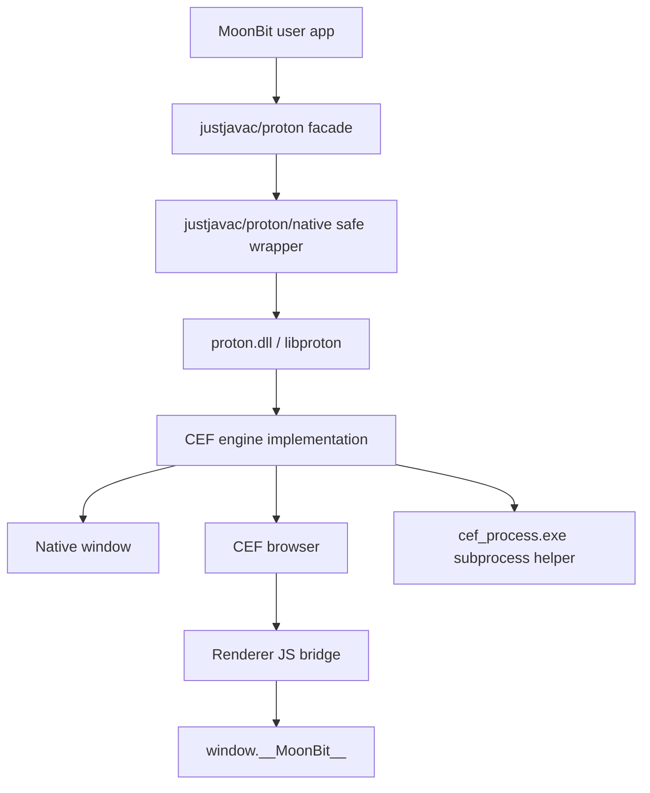

# Proton 当前架构与运行机制

本文描述当前 Proton 代码库的实际架构。它不是旧 `webview` 路线，也不是多后端抽象路线。当前只有一条主线：

```text
MoonBit app
  -> justjavac/proton
  -> justjavac/proton/native
  -> proton native dynamic library
  -> CEF-backed native runtime
  -> cef_process helper executable
```

核心原则：

- MoonBit 用户代码只链接 Proton native library，不直接链接 CEF。
- CEF 是 native implementation detail，不出现在 MoonBit 包名、C ABI 前缀或用户 API 中。
- CMake 是 native 构建的唯一入口。
- MoonBit FFI 尽量简单：通过 `native_link_config.mjs` 链接 `proton` library，不额外引入动态库加载 shim。
- 运行时发布包必须同时包含 native dynamic library 和 helper executable。

## 1. 仓库模块分层

当前相关目录可以按职责分为四层。

### 1.1 native/

`native/` 是独立 CMake 项目，负责构建 C ABI 和 CEF runtime 实现。

关键文件：

- `native/CMakeLists.txt`
  - 唯一 native 构建入口。
  - 构建 `proton` dynamic library。
  - `PROTON_WITH_ENGINE=ON` 时构建并安装 `cef_process.exe`。
  - 安装 CEF runtime 文件到 `native/dist`。
- `native/include/proton_native.h`
  - 对 MoonBit FFI 暴露的稳定 C ABI。
  - 函数统一使用 `proton_*` 前缀。
- `native/src/proton.c`
  - 平台无关的 C ABI 外壳。
  - 负责 handle registry、JSON config 校验、错误码、runtime probe、事件队列和 bridge queue 等通用逻辑。
- `native/src/proton_engine.h`
  - C ABI 外壳与具体 engine 实现之间的内部接口。
- `native/src/proton_engine_none.c`
  - ABI-only engine。
  - 用于无 CEF 环境下跑 binding tests 和 smoke tests。
- `native/src/proton_engine_cef_win.c`
  - 当前 Windows CEF engine 实现。
  - 负责 CEF initialize、Win32 window、CEF browser、renderer bridge、bridge queue、CEF subprocess path 等。
- `native/src/cef_process.c`
  - CEF subprocess helper 入口。
  - 这个文件很小是正常的，它的职责只是尽早调用 `proton_execute_process(...)`，让 CEF 子进程进入 `cef_execute_process(...)`。

### 1.2 proton/native/

`proton/native/` 是 MoonBit 对 C ABI 的安全薄封装。

关键文件：

- `proton/native/ffi.mbt`
  - `extern "C"` 声明。
  - 直接绑定 `proton_*` C ABI。
- `proton/native/native.mbt`
  - 将原始 C status code 转成 `Result[..., NativeError]`。
  - 处理 caller-owned buffer 调用模式。
  - 解码 native 返回的 JSON。
- `proton/native/types.mbt`
  - MoonBit 侧 runtime/window/config/bridge 类型。
  - 使用 `Int64` 保存 native handle id。
- `proton/native/moon.pkg`
  - 只支持 native target。

### 1.3 proton/

`proton/` 是用户主要使用的 facade 包。

关键文件：

- `proton/facade.mbt`
  - 提供 `@proton.html(...)`、`App::run()`、`App::run_or_abort()` 等用户 API。
  - 创建 native runtime/window。
  - 安装 command bridge。
  - 注入 JS proxy。
  - 轮询 native event 和 bridge request。
- `proton/exports.mbt`
  - root facade 对外 re-export。
- `proton/command/`
  - command extension 描述、注册、context、event helper。
- `proton/core/`
  - app command host、op registry、bridge helper 逻辑。
- `proton/ipc/`
  - IPC request/response/event 的 JSON schema。
- `proton/manifest/`
  - app/window/entry/extension manifest 类型。
- `proton/native_link_config.mjs`
  - MoonBit prebuild link config。
  - 负责告诉 MoonBit native backend 如何链接 `proton` library。

### 1.4 examples/ 与 scripts/

- `examples/`
  - 可运行示例。
  - 当前示例应导入 `justjavac/proton`。
  - bridge 相关示例包括 `38_async_extension_add`、`39_sync_async_extensions`、`40_event_broadcast`、`41_app_commands`、`42_attribute_codegen_commands`、`45_bridge_multi_window`。
- `scripts/e2e_bridge_smoke.mjs`
  - CDP-based e2e smoke runner。
  - 要求 `e2e/` 已经列在 `moon.work` 中；脚本不在运行时修改 workspace。
  - 负责验证 bridge、reload、window close、multi-window 等行为。

## 2. 整体运行流程

### 2.1 高层流程图



### 2.2 用户代码入口

最小 app：

```moonbit
import {
  "moonbitlang/async"
  "justjavac/proton"
}

async fn main {
  @proton.html(
    "Demo",
    "<html><body>Hello Proton</body></html>",
    width=900,
    height=700,
    debug=true,
  ).run_or_abort()
}
```

运行时发生的事情：

1. `@proton.html(...)` 构造 `App`。
2. `.run_or_abort()` 调用 `App::run()`。
3. `App::run()` 解析 inline manifest 或 `moon.proton` config。
4. facade 调用 `@native.Runtime::new(config=@native.RuntimeConfig::bundled(...))`。
5. native binding 调用 C ABI `proton_runtime_create_json(...)`。
6. `proton.dll` 根据 `use_bundled=true` 推导 runtime root 和 helper path。
7. Windows engine 初始化 CEF，设置 `browser_subprocess_path`。
8. facade 创建 native window。
9. facade 加载 HTML/URL/File/Asset entry。
10. 如果注册了 command extension，facade 安装 bridge，并进入 bridge pump。
11. 用户关闭窗口后，runtime destroy，资源释放。

## 3. native 构建产物

当前 Windows engine-backed build 的安装布局：

```text
native/dist/
  bin/
    proton.dll
    cef_process.exe
    libcef.dll
    chrome_elf.dll
    icudtl.dat
    resources.pak
    v8_context_snapshot.bin
    *.pak / *.dll / *.bin / *.json
  lib/
    proton.lib
  include/
    proton_native.h
  Resources/
    icudtl.dat
    locales/
      *.pak
```

其中：

- `proton.dll`
  - MoonBit app 运行时加载的 native dynamic library。
  - 内部链接 CEF import library。
- `proton.lib`
  - Windows import library。
  - MoonBit native backend 链接时使用。
- `cef_process.exe`
  - CEF subprocess helper。
  - 必须和 `proton.dll` 同一套 native runtime 发布。
- `Resources/`
  - CEF resources 和 locales。
  - native runtime probe 会校验这些文件。

## 4. 为什么需要 cef_process.exe

CEF 有多进程模型。主进程初始化 CEF 后，CEF 会启动 renderer、GPU、utility 等子进程。

当前架构不让每个 MoonBit app 自己实现 CEF subprocess 分支，而是提供一个统一 helper：

```text
MoonBit app.exe
  loads proton.dll
  proton.dll initializes CEF
  CEF starts cef_process.exe for subprocesses
  cef_process.exe calls proton_execute_process(...)
  proton.dll delegates to cef_execute_process(...)
```

`native/src/cef_process.c` 的代码很短：

```c
int main(void) {
  int32_t exit_code = 0;
  int32_t status =
      proton_execute_process("{\"abi_version\":1,\"use_bundled\":true}",
                             &exit_code);
  if (status == PROTON_PROCESS_HANDLED) {
    return exit_code;
  }
  return status < 0 ? 1 : 0;
}
```

它短是因为它只是 trampoline，不应该包含业务逻辑。

不能删除它的原因：

- `proton_engine_cef_win.c` 初始化 CEF 时会设置 `browser_subprocess_path` 指向 helper。
- `RuntimeConfig::bundled()` 会推导 `bin/cef_process.exe`。
- native runtime probe 会检查 helper 是否存在。
- `native_link_config.mjs` 会把 helper path 作为 `PROTON_HELPER_PATH` 暴露给 MoonBit build/run 环境。
- 删除后，CEF subprocess 无法进入正确入口，真实 runtime 会失败。

如果未来要去掉 helper exe，需要换架构：让用户 app exe 自己尽早调用 `proton_execute_process`。这会把 CEF 进程模型泄漏给 MoonBit 用户，也会让 FFI 使用方式复杂化，不符合当前路线。

## 5. C ABI 设计

### 5.1 ABI 前缀

当前 C ABI 统一使用 `proton_*`：

```c
proton_runtime_create_json(...)
proton_runtime_destroy(...)
proton_window_create_json(...)
proton_window_load_html(...)
proton_window_install_bridge_json(...)
proton_runtime_poll_bridge_request_json(...)
proton_runtime_respond_bridge_request_json(...)
```

不使用 `cef_*` 或 `webview_*`，因为 CEF 是实现细节。

### 5.2 ABI 风格

当前 C ABI 遵循几个固定规则：

- 使用 `int32_t` status code。
- native handle 用 `int64_t` id，不把 C 指针暴露给 MoonBit。
- 配置、事件、bridge request/response 用 JSON 字符串传递。
- 字符串输出使用 caller-owned buffer。
- 所有 config JSON 都要求 `"abi_version": 1`。
- unknown top-level fields 会被拒绝，避免 typo 静默生效。

典型 caller-owned buffer 模式：

```c
int32_t proton_runtime_info_json(
    char *buffer,
    int32_t buffer_len,
    int32_t *out_required_len);
```

MoonBit wrapper 会先用小 buffer 探测长度，再分配足够 buffer 重试。

### 5.3 错误模型

C ABI 返回 status code：

- `PROTON_OK` 表示成功。
- 负数表示错误。
- 特殊正数用于非错误状态，例如：
  - `PROTON_EVENT_NONE`
  - `PROTON_PROCESS_HANDLED`

MoonBit wrapper 将 status 转成：

```moonbit
Result[T, NativeError]
```

其中 `NativeError` 包含：

```moonbit
{
  status : Int
  message : String
}
```

错误消息来自 native `proton_last_error_message(...)`。

## 6. MoonBit FFI 机制

### 6.1 extern 声明

`proton/native/ffi.mbt` 负责声明 C ABI：

```moonbit
extern "C" fn proton_runtime_create_json_ffi(
  config_json : Bytes,
  out_runtime : Ref[Int64],
) -> Int = "proton_runtime_create_json"
```

绑定规则：

- C `int32_t` 映射为 MoonBit `Int`。
- C `int64_t` 映射为 MoonBit `Int64`。
- C `const char *` 入参用 `Bytes`，通过 `@ffi.to_cstr(...)` 生成。
- C output pointer 用 `Ref[T]`。
- 对非 primitive 参数使用 `#borrow(...)` 标注。
- MoonBit 侧不直接接收 C pointer；handle 都是 `Int64`。
- `ffi.mbt` 只做声明，不做业务语义转换。

### 6.2 safe wrapper

用户不直接调用 `ffi.mbt` 里的 extern。`proton/native/native.mbt` 提供 safe wrapper：

```moonbit
pub fn Runtime::new(
  config? : RuntimeConfig = RuntimeConfig::new(),
) -> Result[Runtime, NativeError]
```

wrapper 做三件事：

1. 把 typed config 转成 JSON。
2. 调用 C ABI。
3. 把 status code 和 output handle 转成 `Result[Runtime, NativeError]`。

这一层也是 buffer 调用模式的集中处理点。例如 `runtime_info_json()`、
`poll_event_json()` 和 `poll_bridge_request_json()` 都是先用空/小 buffer
探测 required length，再分配足够大的 `FixedArray[Byte]` 重试，最后用
`@ffi.from_cstr(...)` 转回 MoonBit `String`。这样 C ABI 不需要负责分配
MoonBit 字符串，也避免了跨运行时释放内存的问题。

### 6.3 handle 表示

MoonBit 侧的 runtime/window 不是 C pointer：

```moonbit
struct Runtime {
  mut handle : Int64
}

struct Window {
  mut handle : Int64
}
```

C 侧维护 handle registry。这样做的好处：

- ABI 稳定。
- MoonBit 不需要管理 C pointer lifetime。
- 错误 handle 可以统一返回 `PROTON_ERR_INVALID_HANDLE`。
- 后续跨平台实现可以保持同一 ABI。

### 6.4 root facade 与 native binding 的关系

当前 `justjavac/proton` 根包有两层入口：

1. 高层 facade
   - `@proton.html(...)`
   - `@proton.url(...)`
   - `@proton.file(...)`
   - `@proton.asset(...)`
   - `App::extension(...)`
   - `App::run()` / `App::run_or_abort()`
2. 低层 native re-export
   - `@proton.Runtime::new(...)`
   - `@proton.RuntimeConfig::bundled(...)`
   - `@proton.Window::new(...)`
   - `@proton.runtime_info()`
   - `@proton.probe_runtime(...)`

普通应用应该优先使用高层 facade。低层 native API 主要用于诊断、测试、
或者将来需要手写更细控制的场景。两层最终都会落到同一套
`justjavac/proton/native` binding 和同一组 `proton_*` C ABI。

## 7. native_link_config.mjs

`proton/moon.mod` 配置了：

```moonbit
options(
  "--moonbit-unstable-prebuild": "native_link_config.mjs",
  preferred_target: "native",
  supported_targets: "+native",
)
```

实际入口是仓库根 `native_link_config.mjs`，它 re-export `proton/native_link_config.mjs`。

注意这里不是运行时 `dlopen/LoadLibrary` shim。它的作用是在 MoonBit
native backend 构建阶段告诉编译器/链接器应该链接哪个 Proton native
library，以及在运行相关命令时向环境暴露 native dist 的位置。

link config 输出两类信息：

1. link configs
   - 告诉 MoonBit native backend 链接哪个 library。
   - Windows 下指向 `dist/lib/proton.lib`。
   - macOS/Linux 下使用 `-L... -lproton -Wl,-rpath,...`。
2. vars
   - `PROTON_NATIVE_RUNTIME_DIR`
   - `PROTON_RUNTIME_ROOT`
   - `PROTON_HELPER_PATH`
   - `PROTON_NATIVE_LINK_FLAGS`

Windows 下 `link_configs` 指向 import library，运行时仍然需要
`proton.dll` 能被 Windows loader 找到。当前本地开发通常通过把
`native/dist/bin` 加到 `PATH` 来满足这一点；发布应用时也可以选择把
`proton.dll` 和 helper 放在应用可执行文件旁边，但这属于应用打包层的
决策，不应该改变 MoonBit FFI 绑定方式。

默认 dist 查找顺序：

```text
proton/dist
proton/native/dist
../native/dist
```

用户可以通过环境变量覆盖：

```powershell
$env:PROTON_NATIVE_DIST = "C:\path\to\proton-native-dist"
```

## 8. facade 运行方式

`proton/facade.mbt` 是用户最常接触的层。它负责把简单的
`@proton.html(...)` 调用翻译成 manifest、native runtime、native window
和可选 bridge pump。它不是旧 `webview` binding 的兼容层，而是当前
native DLL 路线上的高层封装。

`App::run()` 开头的 `@async.sleep(0)` 是一次调度让步，不是固定等待。
它不会依赖“一秒后大概率好了”这种时间猜测；真正的 readiness 由
runtime/window 创建结果、bridge install 结果、event polling 和 e2e probe
验证。

### 8.1 无 command extension

无 command extension 时，facade 仍然使用外部消息泵。原因是当前 Windows
engine 初始化 CEF 时使用 `external_message_pump=1`，所以 MoonBit 进程需要
持续调用 `runtime.do_message_loop_work()`，并通过 runtime event 判断窗口是否
已经关闭。

```text
App::run()
  -> Runtime::new(RuntimeConfig::bundled(...))
  -> Window::new(...)
  -> load entry
  -> window.show()
  -> run_window_pump(...)
  -> runtime.destroy()
```

`run_window_pump(...)` 只做两件事：

- `runtime.do_message_loop_work()`
- `runtime.poll_event()`，收到 `window_closed` 后退出

### 8.2 有 command extension

有 command extension 时，facade 不能只调用 `runtime.run()`，因为 MoonBit app 进程需要处理 JS 发来的 bridge request。

流程变为：

```text
App::run()
  -> Runtime::new(...)
  -> Window::new(...)
  -> build AppCommandHost
  -> window.install_bridge(...)
  -> load entry with injected command proxy script
  -> window.show()
  -> run_bridge_pump(...)
```

`run_bridge_pump(...)` 循环做几件事：

- `runtime.do_message_loop_work()`
- `runtime.poll_event()`
- `runtime.poll_bridge_request()`
- spawn async task 处理 command request
- `runtime.respond_bridge_request(...)`
- window close 后清理 pending tasks 和 native pending state

## 9. JavaScript bridge

### 9.1 native 注入的 core bridge

CEF renderer 中注入基础 bridge：

```js
window.__MoonBit__.core.invokeOp(name, payload)
```

它负责：

- 生成 renderer-local pending id。
- 保存 Promise resolve/reject。
- 将 payload 序列化成 JSON。
- 调用 native V8 function `window.__protonNativeInvokeOp(...)`。
- 收到 response 后 resolve/reject Promise。

当前还会生成页面实例 token：

```js
core['@@pageInstance'] = pageInstance;
```

调用 payload 会被包装成内部 envelope：

```json
{
  "__proton_page_instance": "...",
  "payload": { "... user payload ..." }
}
```

MoonBit native wrapper 会解包 envelope，再把原始 `payload` 交给用户 command handler。

### 9.2 facade 注入的 command proxy

facade 根据 extension spec 生成更友好的 proxy：

```js
window.__MoonBit__.add.slowAdd(payload)
window.__MoonBit__.add.invoke("slowAdd", payload)
window.__MoonBit__.add.on("addFinished", listener)
window.__MoonBit__.events.on("add.addFinished", listener)
```

这些 proxy 最终还是调用：

```js
window.__MoonBit__.core.invokeOp("ext:add/slowAdd", payload)
```

### 9.3 event broadcast

MoonBit command handler 可以调用：

```moonbit
context.emit("done", payload)
```

事件经由：

```text
AppCommandExtensionContext::emit
  -> AppCommandHost::emit_extension
  -> facade event_sender
  -> window.eval(extension_event_dispatch_script(...))
  -> window.__MoonBit__.events['@@emitExtensionEvent'](...)
```

为了避免 reload 后旧 command 的事件打到新页面，事件发送会携带 request 的 `page_instance`。JS dispatch script 会检查：

```js
root.core['@@pageInstance'] === expectedPageInstance
```

不匹配则丢弃事件。

## 10. command extension 注册机制

用户或 codegen 生成 extension spec：

```moonbit
@proton_command.AppCommandExtensionSpec::new(
  "examples/add",
  "add",
  [@proton_command.AppCommandApiDescriptor::new("slowAdd")],
  fn(context) {
    context.op_async_result(
      "slowAdd",
      async fn(payload : Payload) {
        ...
      },
      emits_events=true,
    )
    Ok(())
  },
)
```

注册后：

- JS namespace 是 `add`。
- JS API 是 `slowAdd`。
- native bridge op name 是 `ext:add/slowAdd`。
- MoonBit handler 注册到 `AppCommandHost` 的 `OpRegistry`。

`emits_events=true` 的作用：

- 标记这个 op 会在 handler 执行期间调用 `context.emit(...)`。
- bridge dispatch 会给该 op 安装 request-scoped event sender。
- 普通 command 不走 event scope，因此仍保持并发处理。

## 11. reload 与 stale event 处理

问题场景：

1. 页面 A 发起 async command。
2. command 还没结束。
3. 页面 reload，生成页面 B。
4. 页面 A 的 command 继续 emit event。
5. 如果只检查 `location.protocol === "proton:"`，旧 event 会打到页面 B。

当前修复：

- 每个页面注入时生成 `pageInstance`。
- invoke payload envelope 带 `__proton_page_instance`。
- MoonBit `BridgeRequest` 保存 `page_instance`。
- event sender 生成 dispatch script 时带 expected page instance。
- JS dispatch 时检查当前页面 token，不匹配则丢弃。

对应 e2e：

- `40_event_broadcast` reload probe 启动 old run `9100`。
- reload 后新页面启动 run `9101`。
- e2e 等待足够久，断言页面只收到 `9101`，没有 `9100`。

## 12. window close 与 pending request 清理

window close 时，native 需要处理几类状态：

- renderer 已发出、browser pending 还没返回的 request。
- bridge queue 中还没被 MoonBit poll 到的 request。
- MoonBit handler 已完成但 renderer/window 已关闭的 response。

当前 native log guard 验证：

- `bridge_pending_remove_browser`
- `bridge_queue_clear`
- `bridge_pending_clear_all`
- `bridge_response_no_pending` 或 `bridge_response_send_failed`

这保证 close lifecycle 不会因为 stale response 直接崩掉。

## 13. 本地编译和运行

### 13.1 Windows engine build

CEF SDK/runtime 放到 `.cef-cache` 后：

```powershell
cmake -S native -B native\build-engine `
  -DCMAKE_INSTALL_PREFIX=native\dist `
  -DPROTON_WITH_ENGINE=ON `
  -DPROTON_ENGINE_ROOT=.cef-cache

cmake --build native\build-engine --config Debug
cmake --install native\build-engine --config Debug
```

运行示例：

```powershell
$env:PATH = (Resolve-Path native\dist\bin).Path + ';' + $env:PATH
moon -C examples run 01_run --target native
```

构建全部示例：

```powershell
$env:PATH = (Resolve-Path native\dist\bin).Path + ';' + $env:PATH
moon -C examples build --target native
```

### 13.2 native tests

```powershell
ctest --test-dir native\build-engine -C Debug --output-on-failure
node native\scripts\verify_link_config.mjs native\dist
$env:PATH = (Resolve-Path native\dist\bin).Path + ';' + $env:PATH
moon -C proton test --target native --diagnostic-limit 120
moon -C examples build --target native --diagnostic-limit 120
```

### 13.3 e2e

```powershell
$env:PATH = (Resolve-Path native\dist\bin).Path + ';' + $env:PATH
node scripts\e2e_bridge_smoke.mjs 38_async_extension_add 39_sync_async_extensions 40_event_broadcast 41_app_commands 42_attribute_codegen_commands 45_bridge_multi_window
```

e2e runner 要求 `e2e/` 已经在 repo root `moon.work` 中。

## 14. mooncakes.io 安装后的使用方式

用户项目安装：

```sh
moon add justjavac/proton
```

用户 `moon.pkg`：

```moonbit
import {
  "moonbitlang/async"
  "justjavac/proton"
}

supported_targets = "native"

options(
  "is-main": true,
)
```

用户 `main.mbt`：

```moonbit
async fn main {
  @proton.html(
    "Demo",
    "<html><body>Hello Proton</body></html>",
    width=900,
    height=700,
    debug=true,
  ).run_or_abort()
}
```

如果 mooncakes 包内已经包含当前平台的 native dist，理想命令是：

```powershell
moon run . --target native
```

这条命令能成立的前提是包内或安装脚本已经准备好两类东西：

- 构建期：`native_link_config.mjs` 能找到 `proton.lib` 或对应平台的
  `libproton`。
- 运行期：系统 loader 能找到 `proton.dll` / `libproton.so` /
  `libproton.dylib`，并且 native runtime 能找到 helper 和 resources。

如果 native dist 单独下载或由安装脚本放在别处，则用户需要指定：

```powershell
$env:PROTON_NATIVE_DIST = "C:\path\to\proton-native-dist"
$env:PATH = "$env:PROTON_NATIVE_DIST\bin;" + $env:PATH

moon build . --target native
moon run . --target native
```

`PROTON_NATIVE_DIST` 指向的目录必须包含：

```text
bin/proton.dll
bin/cef_process.exe
lib/proton.lib
Resources/
```

Linux/macOS 未来对应：

```text
lib/libproton.so
lib/libproton.dylib
```

但当前真实 engine implementation 只 wired 到 Windows。非 Windows 目前可以做 ABI-only build，不等于完整 GUI runtime 可用。

## 15. 发布与分发模型

当前最佳分发单位不是只有 MoonBit source package，而是：

```text
MoonBit package
  + native runtime dist per platform
```

Windows 发布包至少包含：

```text
proton package files
native dist:
  bin/proton.dll
  bin/cef_process.exe
  bin/CEF runtime dll/data files
  lib/proton.lib
  Resources/
```

用户编译时：

- MoonBit native backend 链接 `proton.lib`。
- 不链接 CEF。
- 不编译 native C 源码。
- 不需要 MoonBit 项目里有 CMake、Makefile 或 native C source。

用户运行时：

- app exe 需要找到 `proton.dll`。
- `proton.dll` 需要找到 `cef_process.exe`。
- `proton.dll` 需要找到 CEF runtime files 和 resources。

也就是说，MoonBit 包解决的是“编译期如何链接 Proton ABI”和“源码层如何
调用 Proton API”；native dist 解决的是“运行期桌面 runtime 如何启动”。
这两个部分必须作为同一版本发布，否则最容易出现链接能过、运行找不到 DLL
或 helper/resources 版本不匹配的问题。

因此发布流程必须保证：

- `native_link_config.mjs` 能找到 install prefix。
- Windows `PATH` 或 app local layout 能找到 `proton.dll`。
- helper 和 resources 与 DLL 版本一致。

## 16. 当前限制

当前限制需要明确，不应在 README 或文档里暗示已经完成：

- 真实 CEF engine 当前只 wired on Windows。
- macOS/Linux 的 `libproton` ABI-only build 可用于接口测试，但还不是完整 GUI runtime。
- 当前不支持旧 `webview_*` C ABI 或旧 `justjavac/proton/webview` 包。
- 不支持多后端 runtime abstraction。
- 不要求 MoonBit 用户调用 `proton_execute_process`。
- 不要求 MoonBit 用户链接 CEF。

## 17. 维护建议

### 17.1 保持 C ABI 稳定

新增 native 能力时优先保持：

- `proton_*` 前缀。
- status code + last error。
- JSON config/request/response schema。
- `abi_version`。
- `Int64` handle id。

不要把 CEF 类型、Win32 类型、C pointer 暴露给 MoonBit。

### 17.2 保持 CMake 单一入口

不要重新加入：

- Makefile native build。
- nmakefile native build。
- MoonBit package 内的 CEF helper build。

native build source of truth 是：

```text
native/CMakeLists.txt
```

### 17.3 保留 cef_process.c

`cef_process.c` 应该保留。它的代码短，但语义重要：

- 它是 helper executable 的入口。
- 它隔离 CEF subprocess model。
- 它让 MoonBit app 不需要知道 `cef_execute_process`。
- 它让每个用户应用不必在自己的 `main` 开头实现 CEF subprocess 分支。

可以加注释、测试和 packaging 验证，但不应该删除。

### 17.4 文档命名避免暴露 CEF

用户层文档应该说：

- Proton native runtime。
- native helper executable。
- packaged runtime dist。

只有 native/internal 文档需要解释 CEF。

## 18. 一句话总结

当前 Proton 是一个 MoonBit facade 加 native dynamic library 的桌面 runtime。MoonBit app 只链接 Proton DLL/import library；CEF 由 native 层封装，subprocess 由 `cef_process.exe` 统一承接；bridge 通过 `window.__MoonBit__` 和 `proton_*` C ABI 在 JS、native、MoonBit handler 之间传递请求、响应和事件。
