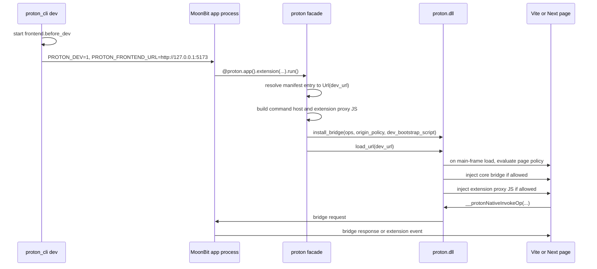

# Proton dev extension JS injection plan

This document is the implementation-ready plan for making extension JavaScript
available when `proton_cli dev` loads a frontend dev server such as Vite or
Next.

## Review outcome

The basic direction is correct: keep one runtime route, keep the MoonBit app
process as the extension host, and let the native DLL inject the bridge into
allowed pages.

The original draft needed five fixes before implementation:

- Current `main` already has `origin_policy` in `BridgeConfig`; dev allowlisting
  must extend that object instead of adding a separate top-level allowlist.
- Native injection must not let the existing `window.__protonBridgeInstalled`
  early return suppress extension proxy injection on load-end or reload paths.
- Event dispatch must share the same page policy as bridge injection; otherwise
  dev pages can call commands but miss extension events.
- Vite and Next should be treated as dev-server origins, not as separate
  integration modes. Framework-specific handling belongs in `frontend.dev_url`
  readiness and origin derivation only.
- The browser-process bridge request path must enforce the same page policy as
  injection. Renderer-side injection is a convenience boundary, not a security
  boundary.

The plan below incorporates those fixes.

## Goal

`proton_cli dev` should support this project shape:

```moonbit
frontend = {
  dev_url: "http://127.0.0.1:5173",
  cwd: "frontend",
  before_dev: "npm run dev -- --host 127.0.0.1 --strictPort",
}
```

That `before_dev` command is for a frontend project that has a `package.json`
and a dev-server script. The repository smoke fixture
`examples/47_dev_extension_js` follows that shape with a small Vite frontend
under `examples/47_dev_extension_js/frontend`.

When the app is started with:

```powershell
proton_cli dev
```

the page served by the frontend dev server should be able to use the same
extension helpers as a static Proton page:

```javascript
await window.__MoonBit__.counter.increment();
await window.__MoonBit__.counter.invoke("reset", null);
```

The solution must keep the native DLL bridge route. It must not add a second
app runtime path, expose CEF in public MoonBit package names, or reintroduce
local WebSocket IPC as the app bridge.

## Current state

Implemented today:

- `proton_cli dev` starts `frontend.before_dev`, waits for `frontend.dev_url`,
  and runs the MoonBit app with `PROTON_DEV=1` and `PROTON_FRONTEND_URL`.
- The facade dev path rewrites the app entry to `Url(frontend.dev_url)`.
- `BridgeConfig` already emits an `origin_policy` object with
  `{ "mode": "app_only" }`.
- Command extensions already produce JavaScript proxy code through
  `build_command_proxy_script`.
- Static `Html`, `File`, and `Asset` entries inject that proxy script into the
  loaded HTML.
- Native CEF injects `window.__MoonBit__.core.invokeOp` for `proton://` pages
  after `window.install_bridge(...)`.

Original gaps this implementation closes:

- `AppEntry::Url` only calls `window.load_url(url)`, so HTTP dev pages do not
  receive the extension proxy script.
- Native bridge injection needed to extend from `proton://` to the configured
  dev HTTP(S) origin so dev pages can receive
  `window.__MoonBit__.core.invokeOp`.
- Extension event dispatch currently checks for `proton:` and skips frontend
  dev-server pages.

## Target architecture

The app process remains the owner of extension registration and bridge
dispatch. The native DLL remains the only browser bridge transport.



## Frontend dev-server model

Vite, Next, and similar tools should use the same Proton dev integration:

- `frontend.dev_url` is the URL Proton opens in the browser window.
- Proton derives an exact origin from that URL and allowlists only that origin.
- Paths, query strings, framework asset paths, HMR endpoints, and websocket
  endpoints do not create separate Proton bridge permissions.
- The native bridge injects only into the main frame for the allowed origin.

This keeps the framework contract simple:

```moonbit
frontend = {
  dev_url: "http://127.0.0.1:5173",
  cwd: "frontend",
  before_dev: "npm run dev -- --host 127.0.0.1 --strictPort",
}
```

This example assumes `frontend/package.json` defines a `dev` script. The e2e
smoke may override the command and port for isolation, but the runtime route is
still `proton_cli dev` starting Vite and opening `frontend.dev_url`.

For Vite:

- Prefer a fixed port in `dev_url`.
- Use `--host 127.0.0.1` or an equivalent explicit host so the URL opened by
  Proton and the origin generated by the facade match.
- HMR websocket traffic is ignored by Proton; it remains owned by Vite.

For Next:

- Prefer a fixed port, for example `http://localhost:3000`.
- If the app uses `basePath`, `dev_url` may include that path, but Proton still
  allowlists only the origin, for example `http://localhost:3000`.
- Next internal routes such as `/_next/*` do not receive a different bridge
  policy. Main-frame navigation under the same origin remains eligible.
- Cross-origin previews, iframes, or asset hosts do not receive the bridge.

If a frontend dev server picks a random fallback port, the CLI cannot safely
infer the correct bridge origin. The first implementation should require a
stable `frontend.dev_url`; port discovery can be added later as an explicit CLI
feature if it becomes necessary.

## Bridge schema

Extend the existing bridge JSON instead of adding a parallel policy:

```json
{
  "abi_version": 1,
  "namespace": "__MoonBit__",
  "origin_policy": {
    "mode": "app_and_dev_origins",
    "dev_origins": ["http://127.0.0.1:5173"]
  },
  "ops": [{ "name": "ext:counter/increment" }],
  "max_payload_bytes": 1048576,
  "request_timeout_ms": 30000,
  "dev_bootstrap_script": "(function(){ ... extension proxy ... })();"
}
```

Supported `origin_policy.mode` values:

- `app_only`: current behavior; only `proton://` pages are eligible.
- `app_and_dev_origins`: `proton://` pages plus exact HTTP(S) origins listed in
  `dev_origins`.

Rules:

- `dev_origins` is allowed only when `mode` is `app_and_dev_origins`.
- `dev_origins` must be a non-empty array for `app_and_dev_origins`.
- `dev_origins` entries must be exact origins, not URLs with path, query, or
  fragment.
- Only `http://` and `https://` dev origins are allowed.
- `localhost`, `127.0.0.1`, and `[::1]` are distinct origins.
- `dev_bootstrap_script` is optional and only meaningful when a dev origin is
  allowed.

Default typed config remains production-safe:

```json
"origin_policy": { "mode": "app_only" }
```

This is an additive JSON/schema change. It does not change exported C function
signatures.

## Injection model

Native injection should use one decision function:

```text
bridge_page_allowed(config, url):
  true if url starts with proton://
  true if origin_policy.mode == app_and_dev_origins
       and url origin exactly matches dev_origins
  false otherwise
```

When the page is allowed:

1. Execute the existing core bridge script, preserving the current
   `window.__protonBridgeInstalled` idempotency.
2. If the loaded page is a dev HTTP(S) page and `dev_bootstrap_script` is
   present, execute `dev_bootstrap_script` separately after the core script,
   guarded by `window.__protonBridgeInstalled` and a per-page
   `window.__protonDevBootstrapInstalled` marker.

Do not concatenate the dev bootstrap behind a core-script early return. The
extension proxy must still be eligible to run when the core bridge is already
installed.

The extension proxy itself should stay idempotent. The generated proxy should
rebuild stable `window.__MoonBit__` fields while preserving its internal event
listener table across repeated execution; avoid adding global state that makes
HMR reloads brittle.

The browser-process request handler must repeat the page-policy check before
accepting `__protonNativeInvokeOp` traffic. This protects against cases where a
renderer binding exists in a context that did not receive the high-level bridge,
or where navigation changes between injection and invocation. Request handling
must validate both:

- frame URL is allowed by `origin_policy`
- operation name is allowed by the existing `ops` allowlist

## Event dispatch model

Extension event dispatch must use the same page policy as bridge injection:

- allow `proton://`
- allow exact dev origins from `origin_policy.dev_origins`
- reject everything else
- keep the `@@pageInstance` guard

This prevents the half-working state where dev pages can call commands but do
not receive emitted extension events.

## Implementation sequence

Implement in the following order. Each step should leave the repository in a
checkable state; do not start with the e2e smoke before the schema and native
validation layers are green.

### 1. MoonBit native config types

Files:

- `proton/native/types.mbt`
- `proton/native/pkg.generated.mbti`
- `proton/native/native_wbtest.mbt`

Add fields to `BridgeConfig`:

```moonbit
dev_origins : Array[String]
dev_bootstrap_script : String?
```

Extend `BridgeConfig::new`:

```moonbit
pub fn BridgeConfig::new(
  ops~ : Array[String],
  max_payload_bytes? : Int = 1048576,
  request_timeout_ms? : Int = 30000,
  dev_origins? : Array[String] = [],
  dev_bootstrap_script? : String? = None,
) -> BridgeConfig
```

`to_json_string` behavior:

- `dev_origins.length() == 0`: emit `origin_policy.mode = "app_only"`.
- `dev_origins.length() > 0`: emit
  `origin_policy.mode = "app_and_dev_origins"` and `dev_origins`.
- Emit `dev_bootstrap_script` only when present.

Add tests proving stable JSON for both default and dev configs.

### 2. Native ABI validation

File:

- `native/src/proton.c`

Update bridge config validation:

- Add top-level allowed key `dev_bootstrap_script`.
- Extend `origin_policy` validation to allow `mode` and `dev_origins`.
- Validate mode enum: `app_only` or `app_and_dev_origins`.
- Reject `dev_origins` with `app_only`.
- Require non-empty `dev_origins` for `app_and_dev_origins`.
- Validate each dev origin as exact `http://` or `https://` origin.
- Validate `dev_bootstrap_script` as a string if present.

Keep existing validation for `namespace`, `ops`, `max_payload_bytes`, and
`request_timeout_ms`.

### 3. Shared native bridge helpers

File:

- `native/src/engine/cef_common/bridge_json.h`

Add helpers here so Windows, Linux, and macOS use one policy:

- `proton_engine_url_is_proton_app(url)`
- `proton_engine_url_origin(url)`
- `proton_engine_bridge_config_allows_page(config_json, url)`
- `proton_engine_bridge_config_is_dev_page(config_json, url)`
- `proton_engine_bridge_config_copy_dev_bootstrap_script(config_json)`

Implementation constraints:

- Return allocated strings only where ownership is explicit.
- Treat malformed config as deny.
- Do exact string comparison for origins.
- Keep `proton_engine_bridge_config_allows_op` unchanged.

### 4. CEF platform injection

Files:

- `native/src/engine/cef_win/proton_engine_cef_win.c`
- `native/src/engine/cef_linux/proton_engine_cef_linux.c`
- `native/src/engine/cef_mac/proton_engine_cef_mac.m`

Update each `proton_engine_inject_bridge_script`:

- Replace the hardcoded `proton://` gate with
  `proton_engine_bridge_config_allows_page`.
- Execute the existing core bridge script for allowed pages.
- If `proton_engine_bridge_config_is_dev_page` is true, execute the copied
  `dev_bootstrap_script` after the core bridge script.
- Free any copied script.
- Keep main-frame-only behavior.

Do not expose CEF in MoonBit package names or public facade APIs.

### 5. Facade page policy and runtime wiring

Files:

- `proton/facade_types.mbt`
- `proton/facade_manifest.mbt`
- `proton/facade_runtime.mbt`
- `proton/facade_bridge.mbt`
- `proton/facade_wbtest.mbt`

Add an internal policy type:

```moonbit
priv struct BridgePagePolicy {
  dev_origin : String?
}
```

Derive policy after resolving the manifest:

- If dev mode is disabled: `dev_origin = None`.
- If resolved entry is `Url(url)` and dev mode is enabled: parse exact origin.
- Otherwise: `dev_origin = None`.

Wire it into `window.install_bridge`:

```moonbit
let dev_origins = match policy.dev_origin {
  Some(origin) => [origin]
  None => []
}
let dev_bootstrap_script = match policy.dev_origin {
  Some(_) => command_proxy_script
  None => None
}
window.install_bridge(
  @native.BridgeConfig::new(
    ops~,
    dev_origins~,
    dev_bootstrap_script~,
  ),
)
```

Keep static `Html`, `File`, and `Asset` injection unchanged. `AppEntry::Url`
continues to call `window.load_url(url)`; native owns dev-page injection.

### 6. Event dispatch wiring

Files:

- `proton/facade_bridge.mbt`
- `proton/facade_runtime.mbt`
- `proton/facade_wbtest.mbt`

Pass `BridgePagePolicy` into:

- `install_extension_event_sender`
- `extension_event_sender`
- `dispatch_bridge_request`
- `extension_event_dispatch_script`

Generate a JS guard equivalent to:

```javascript
function pageAllowed() {
  if (!window.location) return false;
  if (window.location.protocol === "proton:") return true;
  return window.location.origin === "http://127.0.0.1:5173";
}
```

Then apply the existing page-instance guard.

### 7. CLI behavior

No new CLI flags are required for the first implementation.

`proton_cli dev` already provides the necessary inputs:

- `PROTON_DEV=1`
- `PROTON_FRONTEND_URL`
- `frontend.dev_url`
- `frontend.cwd`
- `frontend.before_dev`

Do not make the frontend responsible for loading a generated script in the
first implementation. Native injection is the intended developer experience.

For the production path, add the smallest release build command surface:

- `proton_cli build [PACKAGE] --config moon.proton`

`build` should run `frontend.before_build`, validate `frontend.dist` and the
production entry, then run `moon build <PACKAGE> --target native`. Full platform
installer or zip assembly belongs to the separate packaging work so the dev/build
implementation does not pretend packaging is complete.

## Rollout plan

Use small, reviewable commits or PR slices:

1. Schema and validation: MoonBit `BridgeConfig`, native JSON validation, and
   focused tests.
2. Native injection: shared CEF helper plus Windows/Linux/macOS injection and
   browser-process request gating.
3. Facade wiring: dev origin derivation, bridge install config, event dispatch
   policy, and proxy idempotency.
4. Dev smoke: `examples/47_dev_extension_js` plus `scripts/e2e_bridge_smoke.mjs`
   scenario.
5. Production smoke: build the Vite frontend and verify the same app loads via
   `proton://` with extension helpers and events still available.
6. Documentation: examples/scripts docs and user-facing dev/build behavior
   notes.

The production fallback is unchanged: if no dev origin is present, the emitted
bridge config remains `app_only`, HTTP(S) pages are not eligible, and static
`Html`, `File`, and `Asset` paths keep their existing injection route.

## Tests

### MoonBit tests

Required:

- `BridgeConfig::new(ops=...)` keeps `origin_policy.mode = "app_only"`.
- `BridgeConfig::new(ops=..., dev_origins=["http://localhost:5173"])` emits
  `app_and_dev_origins`.
- `dev_bootstrap_script` is omitted when `None` and emitted when present.
- facade origin parser handles:
  - `http://localhost:5173/app`
  - `https://localhost/app`
  - `http://127.0.0.1:3000`
  - `http://[::1]:5173/app`
- facade rejects non-http dev bridge origins.
- dev manifest keeps extension settings.
- command proxy script still ignores disabled extensions.
- event dispatch script allows the dev origin and keeps `@@pageInstance`.
- static HTML injection behavior is unchanged.

### Native tests

Required:

- Bridge config accepts `app_only`.
- Bridge config accepts `app_and_dev_origins` with valid origins.
- Bridge config rejects:
  - unknown origin policy mode
  - `dev_origins` with `app_only`
  - empty `dev_origins` with `app_and_dev_origins`
  - origins with paths, query, or fragment
  - non-http schemes
  - unknown top-level fields
- Page allow helper accepts `proton://...`.
- Page allow helper accepts exact configured dev origin.
- Page allow helper rejects near misses.
- Op allowlist continues to reject unregistered bridge ops.

### Integration smoke

Add one dev smoke test after the lower layers pass:

1. Start a tiny local HTTP server serving a page that calls an extension command.
2. Start Proton with `PROTON_DEV=1` and `PROTON_FRONTEND_URL`.
3. Verify the page can call `window.__MoonBit__.<namespace>.<api>()`.
4. Reload the page and verify the bridge is reinstalled.
5. Verify an extension event reaches the dev page.

DevTools WebSocket may be used only for automation. It must not become an app
IPC route.

## Validation commands

Use the smallest set while iterating, then run the broader set before handoff.

Native no-engine loop:

```powershell
cmake -S native -B native\build -DCMAKE_INSTALL_PREFIX=native\dist -DPROTON_WITH_ENGINE=OFF
cmake --build native\build --config Debug
cmake --install native\build --config Debug
ctest --test-dir native\build -C Debug --output-on-failure
node native\scripts\verify_link_config.mjs native\dist
```

MoonBit loop:

```powershell
$dist = (Resolve-Path -LiteralPath native\dist).Path
$bin = Join-Path $dist 'bin'
$env:PROTON_NATIVE_DIST = $dist
$env:Path = $bin + ';' + $env:Path
moon -C proton test native --target native --diagnostic-limit 80
moon -C proton test . --target native --diagnostic-limit 80
moon -C cli test dev --target native --diagnostic-limit 80
moon check --target native --diagnostic-limit 80
moon info --target native
moon fmt --check
```

Generated files:

```powershell
node scripts\verify_generated.mjs
```

Engine smoke should be run after the no-engine ABI and MoonBit layers pass.

## Acceptance criteria

- `proton_cli dev` works with Vite and Next pages served from
  `frontend.dev_url`.
- Frontend dev pages can call extension JS helpers without manual script tags.
- Page reload and HMR do not require restarting the MoonBit app.
- Disabled extensions are not exposed to JavaScript.
- Production HTTP pages do not receive bridge injection.
- Static `Html`, `File`, and `Asset` behavior does not regress.
- Extension events work in both static Proton pages and allowed dev-origin
  pages.
- The public C ABI remains additive: no exported function signature changes.

## Implementation notes

- Prefer exact origin parsing in MoonBit for typed config generation and in C
  for native enforcement; do not trust only the facade-side parser.
- Keep bridge request permission based on `ops`; origin allowlisting only
  decides whether the page may receive the bridge object.
- Keep `dev_bootstrap_script` an internal bridge config detail generated by the
  facade. Do not document it as a user-facing native API.
- Do not change `proton/native_link_config.mjs`.
- Do not add a loader shim.
- Do not add WebSocket app IPC.
