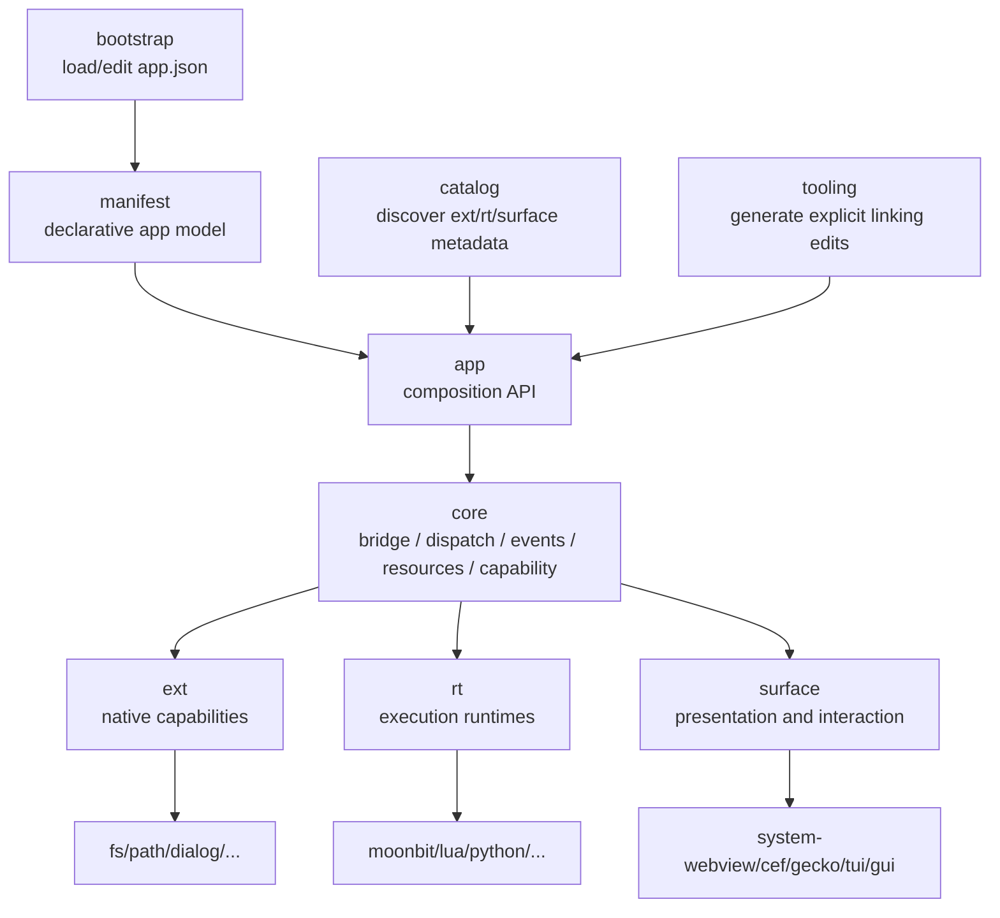

# Lepus 三层可插拔架构设计

本文档记录 Lepus 的长期架构命名和模块划分规划。目标是把 Lepus 做得非常小：默认只提供极薄的应用壳和 JS/native bridge，原生能力、执行运行时、界面呈现方式都通过显式选择和可选编译接入。

本文档中的“三层”不是传统业务系统里的 UI / service / storage 三层，而是 Lepus 的三条正交可插拔轴：

```text
ext      = Extension，能力扩展层
rt       = Runtime，执行运行时层
surface  = Surface，呈现与交互层
```

一句话：

```text
Extension provides capabilities.
Runtime executes logic.
Surface presents interaction.
```

中文表达：

```text
扩展提供能力。
运行时执行逻辑。
呈现面承载交互。
```

## 设计结论

推荐把 Lepus 的可插拔架构固定为：

```text
Lepus core
  + selected surfaces
  + selected runtimes
  + selected extensions
```

其中：

- `ext` 表示 JS 或 app 可以调用哪些 native capability。
- `rt` 表示 native/app logic 或脚本逻辑在哪个执行环境中运行。
- `surface` 表示用户界面使用什么方式呈现和交互。

它们彼此正交：

```text
surface/system-webview + rt/moonbit + ext/fs + ext/dialog
surface/cef            + rt/moonbit + ext/fs + ext/path
surface/tui            + rt/python  + ext/fs
surface/native-gui     + rt/lua     + ext/tray + ext/notification
surface/headless       + rt/quickjs + ext/fs + ext/shell
```

任何一层都不应该默认拉入另一层的所有实现。

## 总体目标

Lepus 的长期目标是：

```text
small core, explicit composition, optional everything
```

具体目标：

- Core 保持小，只提供 bridge、dispatch、resource、event、capability、lifecycle 等基础设施。
- Native API 通过 `ext` 扩展暴露，扩展显式链接、可选编译。
- Host-side 执行环境通过 `rt` 运行时接入，默认 MoonBit，未来可选 Lua、QuickJS、V8、Python 等。
- UI / Web / Terminal / Native GUI 通过 `surface` 接入，默认 system webview，未来可选 CEF、Firefox/Gecko、TUI、native GUI、headless 等。
- Manifest 只声明意图和配置，不隐式链接所有实现。
- Tooling 可以生成显式 imports、registry、surface/runtime setup，但生成结果必须可 review。
- 应用最终只携带它真正选择的能力、运行时和呈现后端。

## 非目标

Lepus 不应该变成：

- 默认捆绑所有扩展的“大运行时”。
- 默认捆绑 Chromium、Python、V8、Lua 等所有 runtime 的“大包”。
- Electron clone。
- Node.js in renderer by default。
- 一个浏览器 fork。
- 一个 GUI toolkit monolith。
- 一个通过 manifest 自动动态加载所有能力的系统。

Lepus 应该更像：

```text
tiny app kernel + explicit compile-time composition
```

## 术语表

| 概念 | 缩写 | 中文 | 示例 | 回答的问题 |
|---|---|---|---|---|
| Extension | ext | 扩展 / 能力模块 | fs, path, dialog, clipboard | App 可以调用哪些 native 能力？ |
| Runtime | rt | 执行运行时 / 语言运行时 | moonbit, lua, quickjs, v8, python | App logic 或脚本逻辑跑在哪里？ |
| Surface | surface | 呈现面 / 交互面 / UI 后端 | system-webview, cef, gecko, tui, native-gui | 用户界面如何呈现和交互？ |
| Core | core | 内核 | bridge, ops, events, resources | 三层如何统一通信和治理？ |
| Manifest | manifest | 声明文档 | app.json | App 想要什么组合和配置？ |
| Registry | registry | 显式注册表 | extension registry, surface registry | 编译产物实际链接了什么？ |
| Capability | capability | 权限能力 | filesystem.read, dialog.open | 当前调用是否被允许？ |

## 为什么选择这三个名字

### Extension

`Extension` 已经是 Lepus 现有设计里的成熟概念。它表达的是能力，不是执行环境，也不是界面后端。

例如：

```text
ext/fs
ext/path
ext/dialog
ext/clipboard
ext/shell
ext/tray
ext/global-hotkey
ext/notification
```

JS 侧看到的是：

```js
await window.__MoonBit__.fs.readFile("a.txt");
await window.__MoonBit__.dialog.openFile();
```

MoonBit 侧通过显式 registry 选择：

```moonbit
let registry = @app.ExtensionRegistry::new()
let _ = registry.register(@fs.spec())
let _ = registry.register(@dialog.spec())
```

### Runtime

`Runtime` 表示 host-side 执行环境。它回答“逻辑在哪里跑”。

例如：

```text
rt/moonbit
rt/lua
rt/quickjs
rt/v8
rt/python
```

它不是 UI runtime，也不是浏览器 runtime，而是 Lepus app logic、extension handler、script plugin 或 automation logic 的执行环境。

如果担心和当前 `runtime/` 包命名冲突，可以在内部目录用：

```text
runtimes/
```

公共术语仍然叫 `Runtime`，缩写 `rt`。

### Surface

`Surface` 表示用户能看到或交互的呈现面。它回答“界面在哪里、如何呈现、如何接收输入”。

这个词比 `renderer`、`engine`、`backend` 更适合 Lepus：

- `renderer` 容易和 Chromium renderer process 混淆。
- `engine` 太泛，Web engine、JS engine、runtime engine 都能叫 engine。
- `backend` 只是实现层后缀，不适合作为用户理解的一等概念。

`Surface` 可以同时覆盖：

```text
surface/system-webview
surface/cef
surface/gecko
surface/tui
surface/native-gui
surface/headless
```

Web 场景里，surface 负责窗口、页面加载、JS 注入、JS/native transport、DevTools、asset origin。

TUI 场景里，surface 负责 terminal screen、keyboard input、layout、event loop。

Native GUI 场景里，surface 负责 native window、widgets、layout、input、menu、drag/drop、accessibility。

Headless 场景里，surface 可以只提供事件循环和 command channel，不创建可见 UI。

## 架构视图



核心原则：

```text
core is the kernel.
ext, rt, and surface are selectable plugin axes.
app composes selected implementations explicitly.
manifest describes intent.
tooling helps generate explicit code.
```

## 三层职责

### ext: 能力扩展层

`ext` 提供 native capability。

负责：

- 声明 JS-facing namespace。
- 声明 methods / events / resources。
- 注册 native handlers。
- 声明 capability policy。
- 提供 helper JS。
- 提供 metadata、schema、docs。
- 管理自己拥有的 native resources，或接入 core resource table。

不负责：

- 创建窗口。
- 决定 UI 使用 CEF 还是 TUI。
- 决定 app logic 使用 Lua 还是 Python。
- 启动浏览器或 terminal 主循环。
- 自动链接其他扩展。

示例：

```text
ext/fs
  methods:
    readFile
    writeFile
    open
    close
  events:
    activity
  capabilities:
    filesystem.read
    filesystem.write
```

### rt: 执行运行时层

`rt` 提供 host-side execution environment。

负责：

- 初始化语言运行时。
- 加载脚本或模块。
- 执行 app logic。
- 执行 runtime-owned handlers。
- 和 core dispatch 互通。
- 管理 runtime 内部对象生命周期。
- 提供 runtime-specific diagnostics。

不负责：

- 暴露 fs/dialog/shell 等 native capability。
- 创建 UI surface。
- 绕过 core 直接调用任意扩展。
- 默认给所有页面开放脚本执行能力。

示例：

```text
rt/moonbit
  default compiled native logic

rt/lua
  run user scripts
  register command handlers

rt/quickjs
  lightweight JS execution outside browser renderer

rt/v8
  advanced JS isolate/runtime integration

rt/python
  scripting, plugins, AI/local automation integrations
```

一个 runtime 可以注册 command handler：

```text
core dispatcher
  -> runtime adapter
  -> lua/python/quickjs handler
  -> structured reply
```

### surface: 呈现与交互层

`surface` 提供 UI presentation and interaction target。

负责：

- 创建和管理窗口或交互面。
- 管理输入事件。
- 管理渲染目标。
- 加载 entry。
- 安装 bridge transport。
- 注入 preload/runtime scripts。
- 提供 surface-specific native handles。
- 管理 surface event loop。
- 提供 surface-specific debugging。

不负责：

- 提供 fs/dialog/shell 等业务能力。
- 决定 app logic 使用哪个语言。
- 默认安装所有扩展。
- 让远程页面默认获得 native capability。

示例：

```text
surface/system-webview
  Windows WebView2
  macOS WKWebView
  Linux WebKitGTK

surface/cef
  embedded Chromium through CEF

surface/gecko
  Firefox/Gecko-based embedding, if feasible

surface/tui
  terminal UI

surface/native-gui
  native widgets

surface/headless
  no visible UI, command/event only
```

## Core 的定位

`core` 不是三层中的某一层。它是三层之下的内核和治理中心。

Core 负责：

- JS/native bridge。
- Dispatcher。
- op / command routing。
- Event bus。
- Resource table。
- Capability checks。
- Structured error model。
- Trace/profiling hooks。
- Extension host。
- Surface transport adapter。
- Runtime invocation adapter。

Core 不应该依赖具体 extension、runtime、surface 实现。

理想依赖方向：

```text
core <- ext/*
core <- rt/*
core <- surface/*
core <- runtime/app composition
```

也可以表达为：

```text
ext, rt, surface plug into core.
app composes them.
```

## App 层的定位

`app` 负责把 manifest、extension registry、runtime selection、surface selection 组合成可运行应用。

它回答：

```text
这个 app 实际选择了哪些 ext？
这个 app 使用哪个 rt？
这个 app 使用哪个 surface？
这些选择和 manifest 是否一致？
```

示意：

```moonbit
let extensions = @app.ExtensionRegistry::new()
let _ = extensions.register(@fs.spec())
let _ = extensions.register(@dialog.spec())

let runtime = @rt_moonbit.runtime()
let surface = @surface_webview.surface()

let app = match @app.create_app(
  manifest,
  extensions,
  runtime~,
  surface~,
) {
  Ok(app) => app
  Err(error) => abort(error)
}

app.run()
```

如果 MoonBit API 不适合一次加入多个 optional label，可以拆成 builder：

```moonbit
let app = @app.AppBuilder::new(manifest)
  .surface(@surface_webview.surface())
  .runtime(@rt_moonbit.runtime())
  .extensions(extensions)
  .build()
```

或者提供显式函数：

```moonbit
@app.create_app_with_surface_and_runtime(
  manifest,
  extensions,
  surface,
  runtime,
)
```

## Manifest 表达

Manifest 只声明意图，不自动链接。

推荐结构：

```json
{
  "surface": {
    "kind": "system-webview",
    "options": {
      "debug": true
    }
  },
  "runtime": {
    "kind": "moonbit",
    "options": {}
  },
  "extensions": {
    "fs": true,
    "dialog": true
  }
}
```

CEF 示例：

```json
{
  "surface": {
    "kind": "cef",
    "options": {
      "remoteDebuggingPort": 9222,
      "cacheDir": ".lepus/cache"
    }
  },
  "runtime": {
    "kind": "moonbit"
  },
  "extensions": {
    "fs": true,
    "path": true
  }
}
```

TUI + Python 示例：

```json
{
  "surface": {
    "kind": "tui"
  },
  "runtime": {
    "kind": "python",
    "options": {
      "entry": "app.py"
    }
  },
  "extensions": {
    "fs": true
  }
}
```

规则：

- Manifest 中出现 `surface.kind = "cef"`，但应用没有显式链接 CEF surface，应报错。
- Manifest 中出现 `runtime.kind = "python"`，但应用没有显式链接 Python runtime，应报错。
- Manifest 中启用了 `fs`，但 registry 没有注册 fs extension，应报错。
- Tooling 可以根据 manifest 生成 import 和 registry 代码，但不能在 runtime 自动引入全部实现。

错误信息示例：

```text
manifest requests surface "cef", but this application did not link a CEF surface.
Import justjavac/lepus_surface_cef and pass @cef.surface(...) to the app builder.
```

```text
manifest enables extension "fs", but the application registry does not contain ext/fs.
Register @fs.spec() or remove the manifest entry.
```

## 显式链接原则

Lepus 的核心原则是显式链接。

```text
manifest declares.
code links.
tooling may generate code.
runtime verifies.
```

不允许：

```text
manifest says "fs": true
  -> runtime magically loads every built-in extension
```

允许：

```text
tooling reads manifest
  -> generates registry module with explicit imports
  -> developer reviews and commits generated code
  -> runtime installs exactly those linked extensions
```

同理：

```text
surface.kind = "cef"
  -> generated code imports lepus_surface_cef
  -> app builder passes @cef.surface(...)
```

## 目录规划

长期可以考虑：

```text
core/
  bridge
  dispatch
  events
  resources
  capability
  errors

app/
  composition
  builder
  validation

manifest/
  app declaration types

bootstrap/
  manifest load/edit/decode

catalog/
  ext catalog
  runtime catalog
  surface catalog
  metadata diagnostics

tooling/
  registry generation
  manifest queries
  add ext
  add runtime
  add surface
  doctor

ext/
  fs/
  path/
  dialog/
  clipboard/
  shell/
  tray/
  notification/

rt/
  moonbit/
  lua/
  quickjs/
  v8/
  python/

surface/
  system_webview/
  cef/
  gecko/
  tui/
  native_gui/
  headless/
```

如果当前仓库不想大迁移，可以保留现有目录，先在文档和 metadata 中确立概念：

```text
extensions/  -> ext layer
runtime/     -> current app/window runtime, not future rt layer
src/         -> current system-webview low-level binding
core/        -> bridge kernel
```

后续再渐进迁移命名。

## Metadata 规划

每个可插拔单元都应有本地 metadata，方便 catalog、tooling、AI diagnostics、docs generation。

### Extension metadata

```json
{
  "kind": "extension",
  "id": "fs",
  "namespace": "fs",
  "methods": [
    {
      "name": "readFile",
      "capability": "filesystem.read"
    }
  ],
  "events": [
    "activity"
  ],
  "dependencies": [
    "path"
  ]
}
```

### Runtime metadata

```json
{
  "kind": "runtime",
  "id": "python",
  "displayName": "Python Runtime",
  "entryKinds": [
    "file",
    "module"
  ],
  "capabilities": [
    "runtime.scripting",
    "runtime.modules"
  ],
  "packageImpact": {
    "bundlesInterpreter": true
  }
}
```

### Surface metadata

```json
{
  "kind": "surface",
  "id": "cef",
  "displayName": "CEF Surface",
  "entryKinds": [
    "html",
    "url",
    "file",
    "asset"
  ],
  "capabilities": [
    "surface.web",
    "surface.devtools",
    "surface.assetOrigin"
  ],
  "packageImpact": {
    "bundlesWebEngine": true
  }
}
```

## Bridge 关系

Web surface 的 bridge：

```text
JS
  -> window.__MoonBit__
  -> core dispatcher
  -> extension handler or runtime handler
  -> structured reply
```

TUI surface 的 bridge：

```text
keyboard / command input
  -> surface event
  -> core dispatcher
  -> extension handler or runtime handler
  -> screen update / event response
```

Native GUI surface 的 bridge：

```text
button/menu/widget event
  -> surface event
  -> core dispatcher
  -> extension handler or runtime handler
  -> widget/window update
```

这意味着 `core` 不能只假设 Web/JS。当前 `window.__MoonBit__` 是 Web surface 的 client runtime；未来 TUI/native GUI 可以有自己的 client adapter。

推荐抽象：

```text
core transport
  call(method, payload) -> reply
  emit(event, payload)
  register_client(surface_window_id, client)
```

Web client 是 `window.__MoonBit__`。

TUI client 是 command/event adapter。

Native GUI client 是 widget event adapter。

## Extension 与 Runtime 的关系

Extension 提供 capability，Runtime 提供 execution。

有三种 handler 形态：

### Native MoonBit handler

```text
ext/fs method
  -> MoonBit function
```

这是当前默认模式。

### Runtime-backed handler

```text
ext/custom method
  -> rt/lua function
```

适合插件系统或应用脚本。

### Hybrid handler

```text
ext/ai method
  -> MoonBit native wrapper
  -> Python runtime for model/tool logic
  -> MoonBit structured reply
```

规则：

- Runtime 可以实现 handler。
- Extension 定义 public capability contract。
- Core 做 dispatch、policy、resource、trace。
- Runtime 不应绕过 core 直接越权访问 extension。

## Surface 与 Runtime 的关系

Surface 和 Runtime 应彼此独立。

允许：

```text
surface/cef + rt/moonbit
surface/cef + rt/python
surface/tui + rt/python
surface/tui + rt/moonbit
surface/headless + rt/quickjs
```

不允许：

```text
surface/cef hardcodes rt/v8 for app logic
surface/tui hardcodes rt/python
rt/python requires surface/system-webview
```

注意：CEF 内部使用 V8，但这不等于 Lepus app 选择了 `rt/v8`。CEF 的 V8 属于 surface 内部实现；`rt/v8` 是 host-side runtime capability。两者必须在术语上分开。

## Surface 与 Extension 的关系

Extension 不应该直接依赖具体 surface。

普通 extension 应只依赖 core：

```text
ext/fs
  -> core op/resource/capability
```

如果需要 surface-specific 能力，应通过 capability 查询：

```text
surface supports file dialog parent window?
surface supports tray menu integration?
surface supports native browser handle?
```

例如 dialog extension 可能需要 parent window handle。它不应该写死 WebView2/CEF，而应该请求：

```text
surface.get_native_handle(window_id, Window)
```

具体 handle 由 surface adapter 返回。

## Capability 模型

Capability 应覆盖三层：

```text
extension capability
  filesystem.read
  dialog.open
  shell.open

runtime capability
  runtime.scripting
  runtime.loadModule
  runtime.eval

surface capability
  surface.web
  surface.devtools
  surface.assetOrigin
  surface.remoteUrlNativeBridge
```

Dispatch 前应检查：

```text
who:
  surface window/client/origin
  runtime identity
  extension namespace

does what:
  method
  resource
  path/url/channel

under which policy:
  manifest
  runtime settings
  debug/release mode
```

Web surface 示例：

```text
remote https://example.com
  -> no native capability by default

https://app.localhost
  -> selected capabilities from manifest

localhost dev server in debug mode
  -> selected capabilities if explicitly allowed
```

## Lifecycle

推荐生命周期：

```text
process start
  -> app bootstrap
  -> load manifest
  -> resolve explicit linked ext/rt/surface
  -> initialize selected runtime
  -> initialize selected surface
  -> install core bridge
  -> install selected extensions
  -> load app entry
  -> run surface event loop
  -> shutdown windows/clients
  -> destroy resources
  -> shutdown runtimes
  -> shutdown surface
```

CEF surface 特殊点：

```text
process start
  -> CEF subprocess check
  -> if renderer/gpu/helper process: run CEF subprocess and exit
  -> browser process continues normal app bootstrap
```

TUI surface 特殊点：

```text
run terminal event loop
  -> keyboard input
  -> core event
  -> runtime/extension handler
  -> screen redraw
```

Headless surface 特殊点：

```text
no window
  -> command/event loop only
```

## Build 和 Package Impact

每个可插拔单元都应声明 package impact。

示例：

```text
ext/fs
  small native code
  no bundled runtime

rt/python
  may bundle Python interpreter and stdlib
  large package impact

surface/system-webview
  small
  depends on OS webview runtime

surface/cef
  large
  bundles Chromium runtime

surface/tui
  small
  terminal dependency only
```

Tooling 可以输出诊断：

```text
Selected surface "cef" bundles Chromium and may add 300-800 MB installed size.
Selected runtime "python" may bundle an interpreter and standard library.
Selected extension "shell" exposes process launching capability.
```

## Examples

### Minimal Web App

```text
surface: system-webview
runtime: moonbit
ext: none
```

适合 hello world、静态页面、只需要 web UI 的应用。

### Desktop App With Native APIs

```text
surface: system-webview
runtime: moonbit
ext: fs, path, dialog, clipboard
```

适合轻量桌面应用。

### Chromium-consistent App

```text
surface: cef
runtime: moonbit
ext: fs, path, shell
```

适合需要跨平台 Chromium 一致性的应用。

### Scriptable Tool

```text
surface: tui
runtime: python
ext: fs, shell
```

适合 terminal-first 工具。

### Plugin-driven App

```text
surface: native-gui
runtime: lua
ext: fs, dialog, tray
```

适合内嵌轻量脚本插件的 GUI 应用。

### Automation / Daemon

```text
surface: headless
runtime: quickjs
ext: fs, shell, notification
```

适合无 UI 的后台任务。

## 命名规范

### IDs

推荐：

```text
ext/fs
ext/path
ext/dialog

rt/moonbit
rt/lua
rt/quickjs
rt/v8
rt/python

surface/system-webview
surface/cef
surface/gecko
surface/tui
surface/native-gui
surface/headless
```

Manifest 中可以用短名：

```json
{
  "surface": { "kind": "cef" },
  "runtime": { "kind": "moonbit" },
  "extensions": { "fs": true }
}
```

Catalog 中用完整 id：

```text
surface/cef
rt/moonbit
ext/fs
```

### Package naming

MoonBit package 可以采用：

```text
justjavac/lepus_ext_fs
justjavac/lepus_rt_lua
justjavac/lepus_surface_cef
```

或者路径式：

```text
justjavac/lepus/ext/fs
justjavac/lepus/rt/lua
justjavac/lepus/surface/cef
```

需要结合 MoonBit package/module 现有限制和发布习惯再定。

### Public API naming

推荐：

```moonbit
@fs.spec()
@lua.runtime()
@cef.surface()
```

避免：

```moonbit
@cef.backend()
@python.engine()
@webview.renderer()
```

原因：

- `backend` 太泛。
- `engine` 会和 JS engine/Web engine 混淆。
- `renderer` 会和 Chromium renderer process 混淆。

## 与当前仓库的映射

当前已有模块可以这样理解：

```text
src/
  current low-level system webview binding
  future: surface/system-webview 的底层依赖或适配目标

core/
  core kernel
  bridge, ops, extension host, resource table

runtime/
  current App/window lifecycle
  future: app-level lifecycle; avoid confusing with rt/*

app/
  composition layer
  manifest + explicit extension registry -> runtime app

manifest/
  declaration types

bootstrap/
  manifest load/edit

extensions/
  current ext layer

catalog/
  current extension catalog
  future: ext/rt/surface catalog

tooling/
  current extension tooling
  future: generate explicit ext/rt/surface wiring
```

需要注意：当前 `runtime/` 包名和未来 `rt` 概念容易混淆。短期可以继续保留，因为它表示 Lepus app runtime/lifecycle。文档中需要明确：

```text
runtime/ package
  App lifecycle runtime

rt layer
  host-side language/execution runtime
```

如果未来大重构，可以考虑把当前 `runtime/` 重命名为：

```text
app_runtime/
shell/
lifecycle/
```

但这属于破坏性重构，不应作为近期前置条件。

## 迁移路线

### M0: 文档和命名固定

产出：

- 本文档。
- 在 README / docs 中固定 ext / rt / surface 三层命名。

验收：

- 团队讨论时不再混用 backend、engine、renderer。

### M1: Catalog 支持三类 metadata

产出：

- `kind = extension | runtime | surface`。
- catalog 能读取和诊断三类条目。

验收：

- extension 现有 catalog 不破坏。
- runtime/surface metadata 可以被 tooling 查询。

### M2: Surface 抽象

产出：

- 抽出 surface-neutral window/view/transport API。
- system webview 作为默认 surface。

验收：

- 当前 examples 默认行为不变。
- `core` 不再强绑定 raw `@webview.Webview`。

### M3: Runtime 抽象

产出：

- `rt/moonbit` 作为默认 runtime。
- 定义 runtime handler registration/invocation API。

验收：

- 现有 MoonBit handlers 行为不变。
- 可以接入一个最小 fake runtime 测试 dispatch。

### M4: Tooling 生成显式组合代码

产出：

- 根据 manifest 生成 selected ext/rt/surface imports。
- 生成 registry/builder module。

验收：

- manifest 不直接隐式链接实现。
- 生成代码可 review。

### M5: 新 surface

候选：

```text
surface/cef
surface/tui
surface/headless
```

建议优先顺序：

```text
headless or tui
  验证 surface 抽象不只服务 Web

cef
  验证重型 Web surface
```

### M6: 新 runtime

候选：

```text
rt/lua
rt/quickjs
rt/python
```

建议优先 Lua 或 QuickJS，因为体积和集成复杂度低于 Python/V8。

## 设计风险

### 名词污染

如果不固定术语，后续会出现：

```text
CEF engine
V8 engine
TUI renderer
Chromium renderer
Python backend
webview backend
```

这些词会让架构讨论变得混乱。本文档建议统一：

```text
ext / rt / surface
```

### Runtime 与现有 runtime 包冲突

当前 `runtime/` 包已经存在。未来 `rt` 是新概念。需要文档和代码命名避免混淆。

### Surface 过度承担能力

Web surface 里有 JS bridge，很容易把 extension capability 塞进 surface。必须坚持：

```text
surface owns presentation and transport.
extension owns native capabilities.
core owns dispatch and policy.
```

### Runtime 越权

Python/Lua 这类 runtime 很容易变成“任意执行本地能力”。必须让 runtime 调用 extension 经过 core capability policy。

### Manifest 诱导隐式链接

用户可能期待 manifest 写了就自动可用。Lepus 必须明确：

```text
manifest declares intent; code links implementation.
```

Tooling 可以帮忙，但不能把 runtime 变成动态全量加载器。

## Open Questions

1. `surface` 中文最终采用“呈现面”、“交互面”还是“界面后端”？
2. 当前 `runtime/` 包是否长期保留，还是未来改名为 `lifecycle` 或 `app_runtime`？
3. `rt` 是否允许多个同时存在，例如 MoonBit 主逻辑 + Python 插件？
4. 一个 app 是否允许多个 surface，例如 WebView 主窗口 + TUI debug console？
5. Runtime-backed extension handler 的注册协议如何设计？
6. Surface client API 是否要从 `window.__MoonBit__` 泛化为 backend-neutral client model？
7. Capability policy 是否按 ext/rt/surface 三类分别声明，还是统一声明？
8. Tooling 生成 registry 时，是否生成一个统一 `composition.mbt`？

## Recommended Short Definition

文档、README 或官网可以用这段短定义：

```text
Lepus is a tiny app shell composed from explicit extensions, pluggable runtimes, and selectable surfaces.
Extensions provide native capabilities, runtimes execute app logic, and surfaces present the user interface.
```

中文：

```text
Lepus 是一个极小的应用壳，由显式扩展、可插拔运行时和可选择呈现面组合而成。
扩展提供 native 能力，运行时执行应用逻辑，呈现面承载用户界面和交互。
```
